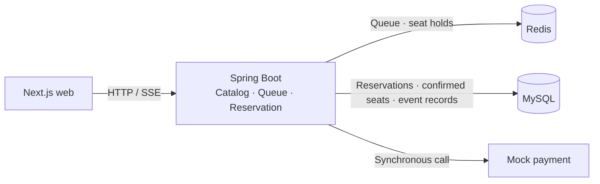

# Ticket Rush

[한국어](README.md) | **English**

[](https://github.com/YongjaeKwon/ticket-rush/actions/workflows/ci.yml)

A concert booking service that explores what happens when several users select the same seat.
The web flow covers browsing events, joining a queue, holding a seat, making a mock payment, and receiving confirmation.

My focus is **keeping reservation state consistent when requests overlap or a response never reaches the user**.
The implementation separates the responsibilities of Redis and the database, with explicit rules and tests for expiry and retries.

## Design choices

### Redis for temporary holds, the database for confirmed bookings

Selecting a seat gives the user five minutes to pay. A Redis hold succeeds only if its key does not already exist, filtering competing requests for that seat.
Because a hold key can be lost, a composite database primary key on `(schedule, seat)` also prevents a second confirmation.

The reservation update, confirmed-seat row, and event record share one DB transaction.
This separates a temporary claim from a confirmed booking and assigns each to storage suited to its lifetime and responsibility.

### Separate waiting for payment from changing the database

Payment is called outside the DB transaction so that waiting for a payment response does not keep a DB connection occupied.
After payment, the service checks reservation state and expiry again inside the transaction. It releases the Redis hold after the confirmation commits.

This means payment approval and database persistence can succeed or fail independently.
Handling a failure between them is a follow-up task described below.

### Distinguish a missing response from a declined payment

A missing payment response does not establish that the server failed to process the request.
The web client therefore queries the reservation first and retains the key for an attempt whose outcome is unknown.
A new attempt after a declined payment receives a new key.

This decision logic is a pure function, separate from the screen code. The [decision record](docs/adr/0006-idempotency-key-per-attempt.en.md) explains the reasoning and limitations.

## Current structure



The backend is a single Spring Boot application with `catalog`, `queue`, and `reservation` modules.
Reservation rules live in Java objects without Spring or JPA dependencies; database and Redis access are implemented separately.

The [web app](apps/web/src/app/) uses Canvas for seat selection and SSE for queue positions and seat-status changes.
It shows the remaining hold time and guides the user according to the payment result. Seat-state decoding and coordinate calculations live in a [shared package](packages/seat-map-core/src/).

**Stack:** Java 21 · Spring Boot 4 · MySQL 8.4 · Redis 7 · Next.js · TypeScript.
Flyway manages database changes; tests use JUnit, Testcontainers, and Vitest.

## Reading the code and tests

**Several holds for one seat must still lead to a single confirmation.**
The [hold service](backend/src/main/java/com/ticketing/reservation/application/service/HoldSeatService.java) and [confirmation service](backend/src/main/java/com/ticketing/reservation/application/service/ConfirmReservationService.java) handle these steps separately.
The [concurrency tests](backend/src/test/java/com/ticketing/reservation/ReservationConcurrencyTest.java) check that 100 threads competing for one seat produce one successful hold. They also delete hold keys to create 10 overlapping holds, then check that concurrent confirmation leaves one confirmed-seat row and one `CONFIRMED` reservation.

**Different failures require different state and retry decisions.**
Integration tests cover [rejecting an expired hold before payment](backend/src/test/java/com/ticketing/reservation/ConfirmReservationIntegrationTest.java), [retaining a hold after a payment decline](backend/src/test/java/com/ticketing/reservation/PaymentDeclinedIntegrationTest.java), and [replaying a stored response for a repeated key](backend/src/test/java/com/ticketing/reservation/ReservationApiIntegrationTest.java).
The [web retry-policy tests](apps/web/src/lib/confirm-policy.test.ts) cover whether to retain an attempt's key for each response type.

**Business rules and external technology should remain separate in the code.**
The [reservation domain](backend/src/main/java/com/ticketing/reservation/domain/Reservation.java) contains the state-transition and expiry rules.
[ArchUnit](backend/src/test/java/com/ticketing/ArchitectureTest.java) and [Spring Modulith checks](backend/src/test/java/com/ticketing/ModularityTest.java) verify dependency direction and module boundaries.

The concurrency tests invoke Java use cases directly against MySQL and Redis in Testcontainers.
Data loss is simulated by deleting hold keys, rather than stopping the Redis server. Backend [CI](.github/workflows/ci.yml) runs the full Gradle suite on pushes to `main` and on pull requests.

## Run locally

Requires Java 21 and Docker. The web app also needs Node.js and the pnpm version specified by the repository's `packageManager` field.
Commands start from the repository root. On Windows, use `.\gradlew.bat` in place of `./gradlew`.

```bash
# Development MySQL, Redis, and backend
docker compose --profile infra up -d
cd backend
./gradlew bootRun
```

```bash
# Start the web app in a new terminal at the repository root
pnpm install --frozen-lockfile
pnpm --filter @ticket-rush/web dev
```

Open the web app at [localhost:3000](http://localhost:3000) or the event API at [localhost:8080/api/events](http://localhost:8080/api/events).
Payment uses a mock adapter, and user identity uses a demo `X-User-Id` header.

<details>
<summary>Test commands</summary>

```bash
# From the repository root. Testcontainers starts separate MySQL and Redis instances.
cd backend
./gradlew test --tests '*ReservationConcurrencyTest'
./gradlew test
```

```bash
# From the repository root
pnpm --filter @ticket-rush/seat-map-core test
pnpm --filter @ticket-rush/web test
```

</details>

## What comes next

The server currently handles idempotency by replaying stored responses.
Execution control for simultaneous requests with the same key, and compensation when the DB write fails after payment approval, remain open tasks.

HTTP latency and throughput have not yet been measured in a load test.
That work will record the environment and scenarios alongside the results. The web booking flow also needs E2E tests and web checks in CI.

The Outbox currently records events in the database. Kafka delivery, service separation, and an Expo app are future plans; details are in the [backlog](docs/backlog.md) (Korean).

## Related documents

- [Architecture](docs/ARCHITECTURE.en.md) — current structure and designs for later stages
- [Decision records](docs/adr/) — alternatives, reasoning, and accepted limitations
- [Visual design](docs/design/design-foundation.en.md) — design tokens and prototype
