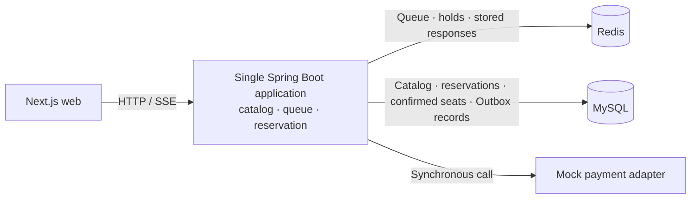

# Ticket Rush

[한국어](README.md) | **English**

[](https://github.com/YongjaeKwon/ticket-rush/actions/workflows/ci.yml)

A ticketing project focused on **preventing duplicate seat confirmations under competing requests**.
It implements queue admission → seat hold → mock payment → confirmation, with tests for contention, expiry, and retries.

**Start with:** [Concurrency tests](backend/src/test/java/com/ticketing/reservation/ReservationConcurrencyTest.java) · [Confirmation service](backend/src/main/java/com/ticketing/reservation/application/service/ConfirmReservationService.java) · [Payment retry decision](docs/adr/0006-idempotency-key-per-attempt.en.md)

## Problems and verification

| Scenario | Behavior checked by the test | Evidence |
|---|---|---|
| 100 threads compete to hold one seat | 1 success, 99 `SEAT_ALREADY_HELD` failures; 1 reservation and 1 event in the DB | [Concurrency tests](backend/src/test/java/com/ticketing/reservation/ReservationConcurrencyTest.java) |
| Lost Redis keys allow 10 holds for one seat | Concurrent confirmation leaves 1 confirmed seat and 1 `CONFIRMED` reservation | [Concurrency tests](backend/src/test/java/com/ticketing/reservation/ReservationConcurrencyTest.java) |
| Payment requested after a hold expires | Rejected with `HOLD_EXPIRED` before calling payment | [Confirmation tests](backend/src/test/java/com/ticketing/reservation/ConfirmReservationIntegrationTest.java) |
| Payment declined | Reservation stays `HELD`, allowing a retry before expiry | [Payment decline test](backend/src/test/java/com/ticketing/reservation/PaymentDeclinedIntegrationTest.java) |
| A completed request is sent again with the same key | Stored response is replayed; a different request with that key is rejected | [API integration tests](backend/src/test/java/com/ticketing/reservation/ReservationApiIntegrationTest.java) |
| Payment result is missing or declined | Response types produce distinct decisions about retaining the attempt's key | [Retry policy tests](apps/web/src/lib/confirm-policy.test.ts) |

The concurrency tests invoke Java use cases directly against **MySQL 8.4 and Redis 7** in Testcontainers.
They simulate data loss by deleting hold keys; they do not stop the Redis server or exercise large-scale HTTP traffic.
Latency and throughput have not yet been measured in a separate load test.

## Design decisions

**Separate temporary holds from final confirmation.** [Redis acquisition](backend/src/main/java/com/ticketing/reservation/adapter/out/redis/RedisSeatHoldAdapter.java) succeeds only when the key does not exist and expires after five minutes. The [reservation domain](backend/src/main/java/com/ticketing/reservation/domain/Reservation.java) checks state and expiry, while the DB's [`confirmed_seat` composite primary key](backend/src/main/resources/db/migration/V1__init.sql) rejects a second confirmation for the same schedule and seat. The reservation update, confirmed-seat row, and Outbox event are written in one DB transaction.

**Define the payment and database transaction boundary.** The [confirmation service](backend/src/main/java/com/ticketing/reservation/application/service/ConfirmReservationService.java) calls mock payment outside the DB transaction, avoiding holding a DB connection while waiting for payment. It checks state and expiry again inside the transaction and releases the Redis hold after commit. Compensation for a DB failure after payment approval remains future work.

**Test retry decisions and code boundaries.** When a payment outcome is unknown, the web client queries the reservation first. A [pure function](apps/web/src/lib/confirm-policy.ts) decides whether to retain the current attempt's key or start a new attempt after a decline. [ADR 0006](docs/adr/0006-idempotency-key-per-attempt.en.md) records the reasoning and server-side limitations. [ArchUnit](backend/src/test/java/com/ticketing/ArchitectureTest.java) and [Spring Modulith checks](backend/src/test/java/com/ticketing/ModularityTest.java) verify dependency direction and module boundaries.

## Current implementation



- **Backend:** catalog and seat queries, Redis queue and admission tokens, hold/confirm/expire/cancel-held-reservation operations, queue and seat-status SSE.
- **Web:** event list/detail, queue, Canvas seat selection, hold countdown, mock payment, and confirmation screens. [Web source](apps/web/src/app/)
- **Seat data:** two bits per seat, with changed seats delivered over SSE. The raw bitmap for 2,000 seats is 500 bytes; this excludes JSON, Base64, and HTTP overhead. [Encoding tests](backend/src/test/java/com/ticketing/catalog/domain/SeatStatusBitmapTest.java) · [Web seat calculations and tests](packages/seat-map-core/src/)

**Stack:** Java 21 · Spring Boot 4 · MySQL 8.4 · Redis 7 · Next.js · TypeScript. Flyway manages DB migrations; tests use JUnit, Testcontainers, and Vitest.

## Run and test

Requires Java 21 and Docker. The web app also needs Node.js and the pnpm version specified by the repository's `packageManager` field.
Commands start from the repository root. On Windows, use `.\gradlew.bat` in place of `./gradlew`.

```bash
# Backend tests: Testcontainers starts separate MySQL and Redis instances
cd backend
./gradlew test --tests '*ReservationConcurrencyTest'
./gradlew test
```

```bash
# New terminal at the repository root: development infrastructure and backend
docker compose --profile infra up -d
cd backend
./gradlew bootRun
```

```bash
# New terminal at the repository root: web tests and development server
pnpm install --frozen-lockfile
pnpm --filter @ticket-rush/seat-map-core test
pnpm --filter @ticket-rush/web test
pnpm --filter @ticket-rush/web dev
```

Open the web app at [localhost:3000](http://localhost:3000) or the event API at [localhost:8080/api/events](http://localhost:8080/api/events).
Backend [CI](.github/workflows/ci.yml) runs the full Gradle test suite on pushes to `main` and on pull requests.

## Next steps

- Server-side execution control for simultaneous requests sharing an idempotency key, and compensation after payment approval followed by DB failure.
- HTTP load tests reporting the environment, scenario, p95/p99 latency, throughput, and duplicate confirmations together.
- Web booking-flow E2E tests and web checks in CI.

Payment currently uses a mock adapter, and user identity uses a demo `X-User-Id` header.
Kafka, the Outbox relay, service separation, and an Expo app are future plans. The current Outbox implementation writes events to the DB only.

## Further reading

- [Architecture](docs/ARCHITECTURE.en.md) — current structure and designs for later stages
- [Decision records](docs/adr/) — alternatives, reasoning, and accepted limitations
- [Backlog](docs/backlog.md) — known limitations and follow-up work (Korean)
- [Visual design](docs/design/design-foundation.en.md) — design tokens and prototype
