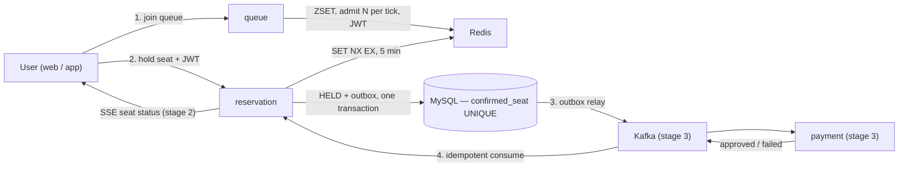

# Ticket Rush — First-Come-First-Served Ticketing System

[한국어](README.md) | **English**


A reservation system built to guarantee **zero double-bookings** even when thousands of users
grab the same seat at the same time. It starts as a monolith and evolves step by step into
Kafka-based separated services, with every stage verified by tests and load-test numbers.

This is not a ticketing practice simulator. The goal is to prove — with tests and metrics —
that data stays consistent under real multi-user contention.

## Core idea — three layers of defense for a seat

Three layers prevent two people from walking away with the same seat.

| Layer | What | Character |
|---|---|---|
| 1st | Redis `SET NX EX` hold (5-min TTL) | Fast. Lets exactly one of the concurrent requests through. Gone if Redis dies |
| 2nd | Domain rule — an expired hold cannot be confirmed | Filters out payments that arrive after someone else may have taken the seat |
| Final | `confirmed_seat` primary key (schedule, seat) in the DB | Even if Redis dies entirely, the database physically rejects a second confirmation INSERT |

An integration test actually recreates the "Redis is dead" scenario and proves that even with
two holds on the same seat, exactly one confirmation survives.

## Booking flow



Users line up in a queue, hold a seat for 5 minutes, and confirm it by paying. If payment
does not arrive in time, the seat is released automatically. In stage 1 payment is a
synchronous mock-adapter call; in stage 3 it becomes event-driven — that swap is one of the
reasons this project uses hexagonal architecture.

## Roadmap and progress

| Stage | What | Status | Tag |
|---|---|---|---|
| 1 | Backend skeleton — monolith + hexagonal (catalog / queue / reservation) | **Done** | `v1-monolith` |
| 2 | Web frontend — mobile web, Canvas seat map, SSE | **Done** | `v2-web` |
| 3 | Service split + Kafka — outbox relay, idempotent consumers, payment compensation | | `v3-msa` |
| 4 | Load-test numbers + virtual-competitor demo | | `v4-bench` |
| 5 | Mobile app (Expo) | | `v5-app` |

### What stage 1 delivered

- **catalog module** — event list/detail, seat layout (ETag + immutable cache), and a seat-status
  bitmap API that compresses the state of 2,000 seats into 500 bytes (2 bits per seat)
- **reservation module** — state-transition rules live in a pure-Java domain; seat hold
  (Redis acquire → DB write → rollback on failure), confirmation (mock payment +
  `confirmed_seat` UNIQUE), an expiry scheduler, and cancellation are use cases.
  All four domain events are written to an outbox table in the same transaction
- **queue module** — ZSET waiting line (re-entering keeps your place), N admissions per second,
  and a 10-minute JWT admission token. The reservation module only verifies the token's
  signature and never calls the queue module — ready for the stage-3 service split
- **REST API + idempotency** — four reservation APIs and two queue APIs. State-changing
  requests carry an Idempotency-Key so a duplicate request replays the stored response
  instead of running twice
- **Concurrency proof** — 100 simultaneous requests for one seat → exactly 1 success (48 ms).
  Even with duplicated holds after a simulated Redis loss, the concurrent-confirmation winner
  is exactly one — zero double-bookings
- **Architecture checks + CI** — three ArchUnit dependency rules and Spring Modulith boundary
  verification (zero violations), plus the full 55-test suite on every push via GitHub Actions

### What stage 2 delivered

<p align="center"></p>

- **Monorepo** — `apps/web` (Next.js App Router) + `packages/api-client` (types generated from the
  backend's openapi.json, no hand-written API types) + `packages/seat-map-core` (bitmap decoding,
  geometry and hit testing in renderer-agnostic pure TS)
- **GATE design system** — a Korean-style ticketing UI distilled from reference sites: deep-indigo
  seat-dot art, no gradients, no colors/shadows/radii outside the token set
  ([design foundation](docs/design/design-foundation.en.md))
- **Queue screen** — receives its position over SSE and falls back to polling when the stream drops.
  On admission it carries the JWT admission token to the seat map
- **Seat map** — 2,000 seats drawn on a single Canvas, no DOM. The seat-status SSE uses one poller
  per schedule that reads the bitmap every 500 ms and sends only the changed seats to every
  subscriber — one DB/Redis read per schedule per tick, regardless of subscriber count
- **Payment and done screens** — one Idempotency-Key per payment attempt: keep the key and check
  with a read first when the result is unknown, discard it once the server has ruled
  ([ADR 0006](docs/adr/0006-idempotency-key-per-attempt.en.md)). Optimistic hold UI, hold
  countdown, wallet pass
- **E2E + CI** — Playwright (Android Chrome emulation) runs the list → done flow plus the
  lost-response, decline and back-navigation scenarios against the real backend. CI also
  verifies that openapi.json still matches the server

## Tech stack

Java 21 · Spring Boot 4.0 · Spring Modulith 2.0 · MySQL 8 (Flyway) · Redis 7 · Testcontainers ·
Kafka (from stage 3) · Next.js (from stage 2)

The reasoning behind each choice is recorded as [ADRs](docs/adr/), e.g.
[why Java/Spring over NestJS](docs/adr/0001-java-spring-over-nestjs.en.md) and
[why contention tables have no foreign keys](docs/adr/0003-no-fk-on-contention-tables.en.md).

## Numbers (to be filled in stage 4)

| Item | Result |
|---|---|
| Double bookings under load | — (target: 0) |
| Hold API p99 (10,000 concurrent requests) | — ms |
| Throughput | — req/s |
| DB error rate, with vs. without queue | — % vs — % |
| `SET NX` vs Redisson vs DB pessimistic lock — p99 | — / — / — ms |
| Lighthouse mobile / LCP / INP | — / — s / — ms |
| SSE diff payload (2,000 seats) | — bytes |
| App cold start (mid-range Android) | — s |

## Running it

```bash
docker compose --profile infra up -d      # MySQL (host port 3307), Redis
cd backend
./gradlew test                            # full test suite (needs Docker — Testcontainers)
./gradlew bootRun                         # http://localhost:8080
```

```bash
curl http://localhost:8080/api/events     # check the seeded event list
```

```bash
pnpm install                              # from the repo root
pnpm -F web dev                           # http://localhost:3000 (backend must be running)
pnpm -F web test                          # unit tests (vitest)
pnpm -F web e2e                           # Playwright E2E — mobile emulation (backend must be running)
curl -s localhost:8080/v3/api-docs -o openapi.json   # pull the contract from the server (always from 8080)
pnpm gen:api                              # openapi.json → packages/api-client types
```

## Documents

- [Architecture](docs/ARCHITECTURE.en.md) — diagrams, stack, code structure, domain, events, APIs, infra, interview notes, glossary
- [Design foundation](docs/design/design-foundation.en.md) — design tokens and screen grammar, with a [working prototype](docs/design/gate1-prototype.html)
- [Decision records (ADR)](docs/adr/) · agent working rules: [CLAUDE.md](CLAUDE.md) (Korean only — single source of truth for agents)
