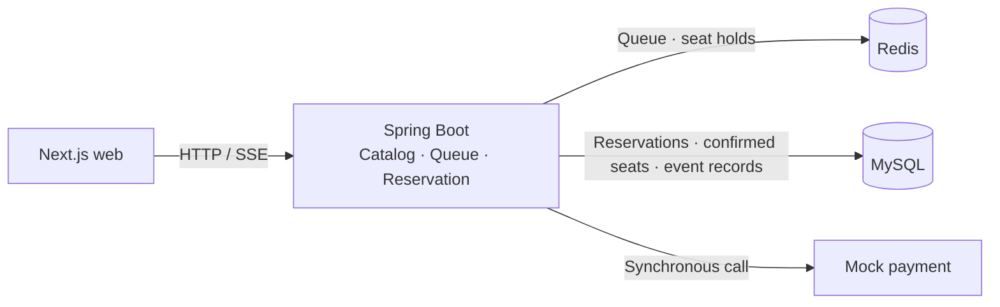
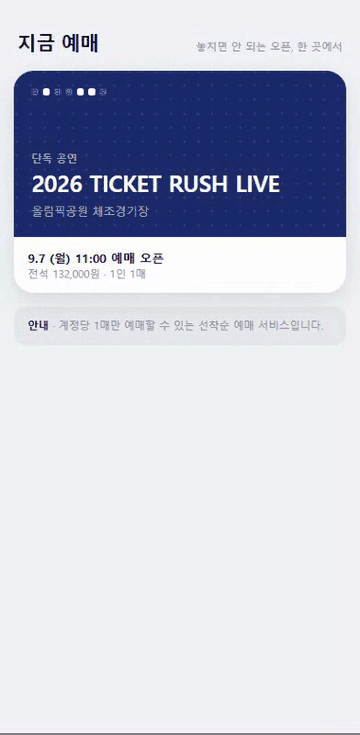

# Ticket Rush

[한국어](README.md) | **English**

A concert booking service covering queue admission, seat selection, mock payment, and reservation confirmation.


*Seat-selection design prototype — a preview used to design the screens and booking flow. [Prototype source](docs/design/gate1-prototype.html)*

## Key features

- **Prevent duplicate seat confirmations.** Redis holds a seat for five minutes; a MySQL primary key on `(schedule, seat)` limits final confirmation. The reservation update, confirmed-seat row, and event record share one transaction. [Confirmation service](backend/src/main/java/com/ticketing/reservation/application/service/ConfirmReservationService.java) · [Concurrency tests](backend/src/test/java/com/ticketing/reservation/ReservationConcurrencyTest.java)
- **Handle retries when a payment response is missing.** The client queries the reservation first and retains the key for an attempt whose outcome is unknown. A new attempt after a decline gets a new key. [Retry rules](apps/web/src/lib/confirm-policy.ts) · [Tests](apps/web/src/lib/confirm-policy.test.ts) · [Decision record](docs/adr/0006-idempotency-key-per-attempt.en.md)
- **Connect the queue and seat selection in the web app.** SSE delivers queue positions and seat-status changes; Canvas handles seat selection. The app shows the remaining payment time after a hold. [Web screens](apps/web/src/app/) · [Seat calculations](packages/seat-map-core/src/) · [Queue SSE test](backend/src/test/java/com/ticketing/queue/QueueStreamIntegrationTest.java)

## Current structure



The backend is a single Spring Boot application with `catalog`, `queue`, and `reservation` modules.
Reservation rules live in Java objects without Spring or JPA dependencies; database and Redis access are implemented separately.

The [web app](apps/web/src/app/) uses Canvas for seat selection and SSE for queue positions and seat-status changes.
It shows the remaining hold time and guides the user according to the payment result. Seat-state decoding and coordinate calculations live in a [shared package](packages/seat-map-core/src/).

<p align="center"></p>

*The implemented screens — from the event list to a confirmed booking, recorded with Playwright mobile emulation.*

**Stack:** Java 21 · Spring Boot 4 · MySQL 8.4 · Redis 7 · Next.js · TypeScript.
Flyway manages database changes; tests use JUnit, Testcontainers, Vitest, and Playwright.

<details>
<summary>Behavior covered by the code and tests</summary>

**Several holds for one seat must still lead to a single confirmation.**
The [hold service](backend/src/main/java/com/ticketing/reservation/application/service/HoldSeatService.java) and [confirmation service](backend/src/main/java/com/ticketing/reservation/application/service/ConfirmReservationService.java) handle these steps separately.
The [concurrency tests](backend/src/test/java/com/ticketing/reservation/ReservationConcurrencyTest.java) check that 100 threads competing for one seat produce one successful hold. They also delete hold keys to create 10 overlapping holds, then check that concurrent confirmation leaves one confirmed-seat row and one `CONFIRMED` reservation.

**Different failures require different state and retry decisions.**
Integration tests cover [rejecting an expired hold before payment](backend/src/test/java/com/ticketing/reservation/ConfirmReservationIntegrationTest.java), [retaining a hold after a payment decline](backend/src/test/java/com/ticketing/reservation/PaymentDeclinedIntegrationTest.java), and [replaying a stored response for a repeated key](backend/src/test/java/com/ticketing/reservation/ReservationApiIntegrationTest.java).
The [web retry-policy tests](apps/web/src/lib/confirm-policy.test.ts) cover whether to retain an attempt's key for each response type.
In the browser, the [Playwright E2E suite](apps/web/e2e/idempotency.spec.ts) checks both kinds of lost response (never reached the server / processed but the response was lost), a payment decline, and hold restoration after back-navigation, against a running backend.

**Business rules and external technology should remain separate in the code.**
The [reservation domain](backend/src/main/java/com/ticketing/reservation/domain/Reservation.java) contains the state-transition and expiry rules.
[ArchUnit](backend/src/test/java/com/ticketing/ArchitectureTest.java) and [Spring Modulith checks](backend/src/test/java/com/ticketing/ModularityTest.java) verify dependency direction and module boundaries.

The concurrency tests invoke Java use cases directly against MySQL and Redis in Testcontainers.
Data loss is simulated by deleting hold keys, rather than stopping the Redis server. [CI](.github/workflows/ci.yml) runs the full backend suite and the web checks (types, unit tests, openapi contract diff, Playwright E2E) on pushes to `main` and on pull requests.

</details>

## Run locally

Requires Java 21 and Docker. The web app also needs Node.js and the pnpm version specified by the repository's `packageManager` field.
Commands start from the repository root. On Windows, use `.\gradlew.bat` in place of `./gradlew`.

```bash
# Development MySQL, Redis, and backend
docker compose --profile infra up -d
cd backend
./gradlew bootRun
```

```bash
# Start the web app in a new terminal at the repository root
pnpm install --frozen-lockfile
pnpm --filter @ticket-rush/web dev
```

Open the web app at [localhost:3000](http://localhost:3000) or the event API at [localhost:8080/api/events](http://localhost:8080/api/events).
Payment uses a mock adapter, and user identity uses a demo `X-User-Id` header.

<details>
<summary>Test commands</summary>

```bash
# From the repository root. Testcontainers starts separate MySQL and Redis instances.
cd backend
./gradlew test --tests '*ReservationConcurrencyTest'
./gradlew test
```

```bash
# From the repository root
pnpm --filter @ticket-rush/seat-map-core test
pnpm --filter @ticket-rush/web test
pnpm --filter @ticket-rush/web e2e        # Playwright E2E — the backend must be running
```

```bash
# When the API contract changes — always fetch from a backend on 8080 (the servers URL follows the request address)
curl -s localhost:8080/v3/api-docs -o openapi.json
pnpm gen:api
```

</details>

## What comes next

The server currently handles idempotency by replaying stored responses.
Execution control for simultaneous requests with the same key, and compensation when the DB write fails after payment approval, remain open tasks.

HTTP latency and throughput have not yet been measured in a load test.
That work will record the environment and scenarios alongside the results.

The Outbox currently records events in the database. Kafka delivery, service separation, and an Expo app are future plans; details are in the [backlog](docs/backlog.md) (Korean).

## Related documents

- [Architecture](docs/ARCHITECTURE.en.md) — current structure and designs for later stages
- [Decision records](docs/adr/) — alternatives, reasoning, and accepted limitations
- [Visual design](docs/design/design-foundation.en.md) — design tokens and prototype
