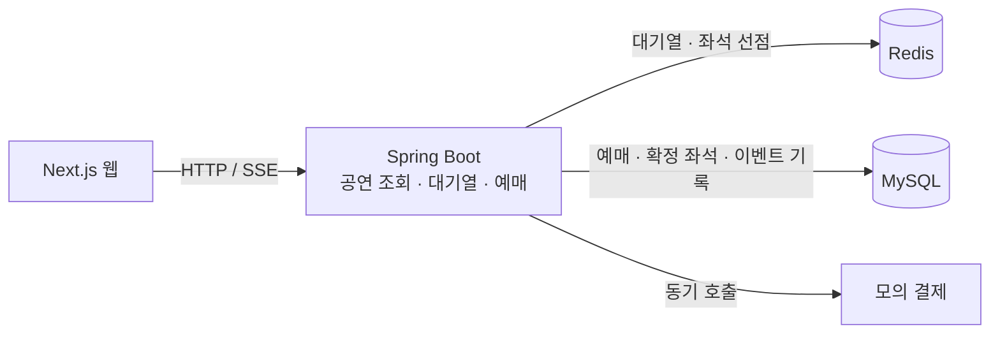

# 티켓러시

**한국어** | [English](README.en.md)

대기열 입장부터 좌석 선택, 모의 결제, 예매 완료까지 구현한 공연 예매 서비스입니다.


*좌석 선택 디자인 프로토타입 — 화면 구성과 예매 흐름을 설계한 미리보기입니다. [프로토타입 원본](docs/design/gate1-prototype.html)*

## 핵심 구현

- **같은 좌석의 중복 확정 방지.** Redis로 좌석을 5분간 선점하고, MySQL의 `(회차, 좌석)` 기본키로 최종 확정을 제한합니다. 예매 상태·확정 좌석·이벤트 기록은 하나의 트랜잭션으로 묶었습니다. [확정 처리](backend/src/main/java/com/ticketing/reservation/application/service/ConfirmReservationService.java) · [동시성 테스트](backend/src/test/java/com/ticketing/reservation/ReservationConcurrencyTest.java)
- **결제 응답을 받지 못했을 때의 재시도.** 예매 상태를 먼저 조회하고 같은 시도의 키를 유지합니다. 결제 거절 뒤 새로 시도할 때는 다른 키를 사용합니다. [재시도 규칙](apps/web/src/lib/confirm-policy.ts) · [테스트](apps/web/src/lib/confirm-policy.test.ts) · [선택 이유](docs/adr/0006-idempotency-key-per-attempt.md)
- **대기열부터 좌석 선택까지 웹에서 연결.** SSE로 대기 순번과 좌석 상태를 전달하고, Canvas로 좌석을 선택합니다. 선점 후에는 남은 결제 시간을 보여 줍니다. [웹 화면](apps/web/src/app/) · [좌석 계산](packages/seat-map-core/src/) · [대기열 SSE 테스트](backend/src/test/java/com/ticketing/queue/QueueStreamIntegrationTest.java)

## 현재 구성



백엔드는 하나의 Spring Boot 애플리케이션 안에 공연 조회(`catalog`), 대기열(`queue`), 예매(`reservation`) 모듈을 두었습니다.
예매 규칙은 Spring·JPA에 의존하지 않는 Java 객체에 두고, DB와 Redis를 사용하는 코드는 별도로 분리했습니다.

[웹](apps/web/src/app/)에서는 Canvas로 좌석을 선택하고, SSE로 대기 순번과 좌석 상태의 변화를 받습니다.
남은 선점 시간을 보여 주고 결제 결과에 따라 다음 행동을 안내합니다. 좌석 상태 해석과 좌표 계산은 [공통 패키지](packages/seat-map-core/src/)로 분리했습니다.

**사용 기술:** Java 21 · Spring Boot 4 · MySQL 8.4 · Redis 7 · Next.js · TypeScript.
DB 변경은 Flyway로 관리하고, 테스트에는 JUnit·Testcontainers·Vitest를 사용합니다.

<details>
<summary>코드와 테스트에서 확인한 동작</summary>

**좌석을 선점한 요청이 여러 건이어도 최종 확정은 하나여야 합니다.**
[선점 처리](backend/src/main/java/com/ticketing/reservation/application/service/HoldSeatService.java)와 [확정 처리](backend/src/main/java/com/ticketing/reservation/application/service/ConfirmReservationService.java)를 나누어 읽을 수 있습니다.
[동시성 테스트](backend/src/test/java/com/ticketing/reservation/ReservationConcurrencyTest.java)는 같은 좌석에 100개 스레드가 선점을 시도했을 때 성공이 1건인지 확인합니다. 선점 키를 삭제해 중복 홀드 10건을 만든 뒤, 동시에 확정해도 확정 좌석과 `CONFIRMED` 예매가 각각 1건인지도 확인합니다.

**실패의 종류에 따라 예매 상태와 재시도 방식이 달라져야 합니다.**
[만료된 홀드의 결제 거절](backend/src/test/java/com/ticketing/reservation/ConfirmReservationIntegrationTest.java), [결제 거절 시 홀드 유지](backend/src/test/java/com/ticketing/reservation/PaymentDeclinedIntegrationTest.java), [같은 키로 재요청했을 때의 응답 재생](backend/src/test/java/com/ticketing/reservation/ReservationApiIntegrationTest.java)을 통합 테스트로 확인합니다.
[웹의 재시도 정책 테스트](apps/web/src/lib/confirm-policy.test.ts)는 응답 유형에 따라 시도 키를 유지할지 판단하는 규칙을 다룹니다.

**업무 규칙과 외부 기술의 경계가 코드에서도 유지되어야 합니다.**
[예매 도메인](backend/src/main/java/com/ticketing/reservation/domain/Reservation.java)에 상태 전이와 만료 규칙을 모았습니다.
[ArchUnit](backend/src/test/java/com/ticketing/ArchitectureTest.java)과 [Spring Modulith 검사](backend/src/test/java/com/ticketing/ModularityTest.java)는 계층 의존 방향과 모듈 경계를 확인합니다.

동시성 테스트는 Testcontainers의 MySQL·Redis를 사용해 Java 유스케이스를 직접 호출합니다.
Redis 서버를 중단시키는 대신 홀드 키를 삭제해 데이터 유실 상황을 재현합니다. 백엔드 [CI](.github/workflows/ci.yml)는 `main` push와 PR에서 전체 Gradle 테스트를 실행합니다.

</details>

## 실행

Java 21과 Docker가 필요합니다. 웹은 Node.js와 저장소의 `packageManager`에 지정된 pnpm을 사용합니다.
명령은 저장소 루트에서 시작하며, Windows에서는 `./gradlew` 대신 `.\gradlew.bat`를 사용합니다.

```bash
# 개발용 MySQL·Redis와 백엔드
docker compose --profile infra up -d
cd backend
./gradlew bootRun
```

```bash
# 저장소 루트의 새 터미널에서 웹 실행
pnpm install --frozen-lockfile
pnpm --filter @ticket-rush/web dev
```

웹은 [localhost:3000](http://localhost:3000), 공연 API는 [localhost:8080/api/events](http://localhost:8080/api/events)에서 확인할 수 있습니다.
결제는 mock 어댑터로 처리하며 사용자 식별에는 데모용 `X-User-Id`를 사용합니다.

<details>
<summary>테스트 실행 명령</summary>

```bash
# 저장소 루트에서 실행. Testcontainers가 별도 MySQL·Redis를 시작합니다.
cd backend
./gradlew test --tests '*ReservationConcurrencyTest'
./gradlew test
```

```bash
# 저장소 루트에서 실행
pnpm --filter @ticket-rush/seat-map-core test
pnpm --filter @ticket-rush/web test
```

</details>

## 다음에 다룰 문제

서버의 멱등 처리는 현재 저장된 응답을 재생하는 방식입니다.
같은 키로 동시에 들어오는 요청의 실행 제어와, 결제 승인 뒤 DB 저장에 실패했을 때의 보상 처리가 남아 있습니다.

HTTP 부하 테스트의 응답시간·처리량은 아직 측정하지 않았습니다.
실행 환경과 시나리오를 함께 기록해 측정하고, 웹의 전체 예매 흐름에 대한 E2E 테스트와 CI 검사도 추가할 계획입니다.

Outbox는 이벤트를 DB에 기록하는 단계까지 구현했습니다. Kafka를 통한 이벤트 전달, 서비스 분리, Expo 앱은 후속 계획이며, 세부 사항은 [백로그](docs/backlog.md)에 정리했습니다.

## 관련 문서

- [설계 문서](docs/ARCHITECTURE.md) — 현재 구조와 후속 단계 설계
- [결정 기록](docs/adr/) — 대안, 선택 이유, 받아들인 제약
- [화면 디자인](docs/design/design-foundation.md) — 디자인 토큰과 프로토타입
