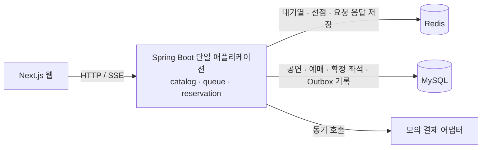

# 티켓러시

**한국어** | [English](README.en.md)

[](https://github.com/YongjaeKwon/ticket-rush/actions/workflows/ci.yml)

같은 좌석을 여러 사용자가 동시에 선택할 때 **중복 확정을 막는 예매 프로젝트**입니다.
대기열 → 좌석 선점 → 모의 결제 → 예매 완료 흐름을 구현하고, 경쟁 요청·만료·재시도를 테스트로 확인합니다.

**먼저 볼 코드:** [동시성 테스트](backend/src/test/java/com/ticketing/reservation/ReservationConcurrencyTest.java) · [예매 확정 처리](backend/src/main/java/com/ticketing/reservation/application/service/ConfirmReservationService.java) · [결제 재시도 결정 기록](docs/adr/0006-idempotency-key-per-attempt.md)

## 해결한 문제와 검증

| 상황 | 테스트에서 확인하는 동작 | 근거 |
|---|---|---|
| 같은 좌석에 100개 스레드가 동시에 선점 요청 | 성공 1건, `SEAT_ALREADY_HELD` 99건. DB 예매와 이벤트도 각 1건 | [동시성 테스트](backend/src/test/java/com/ticketing/reservation/ReservationConcurrencyTest.java) |
| Redis 홀드 키 유실로 같은 좌석에 홀드 10건 생성 | 동시에 확정해도 확정 좌석과 `CONFIRMED` 예매는 각 1건 | [동시성 테스트](backend/src/test/java/com/ticketing/reservation/ReservationConcurrencyTest.java) |
| 선점 시간이 지난 뒤 결제 요청 | 결제 전에 `HOLD_EXPIRED`로 거절 | [확정 통합 테스트](backend/src/test/java/com/ticketing/reservation/ConfirmReservationIntegrationTest.java) |
| 결제 거절 | 예매를 `HELD`로 유지해 남은 시간 안에 재시도 가능 | [결제 거절 테스트](backend/src/test/java/com/ticketing/reservation/PaymentDeclinedIntegrationTest.java) |
| 처리된 요청을 같은 키로 다시 전송 | 저장된 응답 재생. 같은 키에 다른 요청은 충돌로 거절 | [API 통합 테스트](backend/src/test/java/com/ticketing/reservation/ReservationApiIntegrationTest.java) |
| 결제 결과를 받지 못하거나 거절됨 | 응답 유형별로 같은 시도의 키를 유지할지 구분 | [재시도 정책 테스트](apps/web/src/lib/confirm-policy.test.ts) |

동시성 테스트는 Testcontainers의 **MySQL 8.4·Redis 7**을 사용해 Java 유스케이스를 직접 호출합니다.
홀드 키 삭제로 데이터 유실을 재현하며, Redis 서버 중단이나 대규모 HTTP 트래픽을 검증한 테스트는 아닙니다.
응답시간·처리량은 아직 별도 부하 시험으로 측정하지 않았습니다.

## 설계에서 집중한 부분

**좌석 선점과 최종 확정을 분리했습니다.** [Redis 선점](backend/src/main/java/com/ticketing/reservation/adapter/out/redis/RedisSeatHoldAdapter.java)은 키가 없을 때만 성공하며 5분 뒤 만료됩니다. [예매 도메인](backend/src/main/java/com/ticketing/reservation/domain/Reservation.java)은 상태와 만료 시각을 검사하고, DB의 [`confirmed_seat` 복합 기본키](backend/src/main/resources/db/migration/V1__init.sql)가 같은 회차·좌석의 두 번째 확정을 거절합니다. 예매 상태 변경·확정 좌석·Outbox 이벤트 기록은 한 DB 트랜잭션으로 묶었습니다.

**결제 호출과 DB 트랜잭션의 경계를 정했습니다.** [확정 처리](backend/src/main/java/com/ticketing/reservation/application/service/ConfirmReservationService.java)는 모의 결제를 트랜잭션 밖에서 호출해 결제 응답을 기다리는 동안 DB 커넥션을 점유하지 않도록 합니다. 이후 트랜잭션 안에서 예매 상태와 만료를 다시 검사하고, 커밋 뒤 Redis 홀드를 해제합니다. 결제 승인 뒤 DB 실패에 대한 보상 처리는 남은 과제입니다.

**재시도 규칙과 코드 경계를 테스트로 고정했습니다.** 결제 화면은 결과를 알 수 없을 때 예매 상태를 먼저 조회합니다. 같은 시도의 키를 유지할지, 거절 뒤 새 시도의 키를 만들지는 [순수 함수](apps/web/src/lib/confirm-policy.ts)로 분리했습니다. 서버 측 제약과 선택 이유는 [ADR 0006](docs/adr/0006-idempotency-key-per-attempt.md)에 기록했습니다. [ArchUnit](backend/src/test/java/com/ticketing/ArchitectureTest.java)과 [Spring Modulith 검사](backend/src/test/java/com/ticketing/ModularityTest.java)로 계층 의존 방향과 모듈 경계도 확인합니다.

## 현재 구현



- **백엔드:** 공연·좌석 조회, Redis 대기열과 입장 토큰, 좌석 선점·확정·만료·선점 취소, 대기열·좌석 상태 SSE.
- **웹:** 공연 목록·상세, 대기열, Canvas 좌석 선택, 선점 시간 표시, 모의 결제·완료 화면. [웹 코드](apps/web/src/app/)
- **좌석 데이터:** 좌석당 2비트로 상태를 표현하고 SSE로 변경 좌석을 전달합니다. 2,000석의 원시 비트맵은 500바이트이며 JSON·Base64·HTTP 전송 크기와는 다릅니다. [인코딩 테스트](backend/src/test/java/com/ticketing/catalog/domain/SeatStatusBitmapTest.java) · [웹 좌석 계산과 테스트](packages/seat-map-core/src/)

**기술:** Java 21 · Spring Boot 4 · MySQL 8.4 · Redis 7 · Next.js · TypeScript. DB 변경은 Flyway, 테스트는 JUnit·Testcontainers·Vitest를 사용합니다.

## 실행과 테스트

Java 21, Docker가 필요합니다. 웹은 Node.js와 저장소의 `packageManager`에 지정된 pnpm을 사용합니다.
명령은 저장소 루트 기준이며, Windows에서는 `./gradlew` 대신 `.\gradlew.bat`를 사용합니다.

```bash
# 백엔드 테스트: Testcontainers가 별도 MySQL·Redis를 실행
cd backend
./gradlew test --tests '*ReservationConcurrencyTest'
./gradlew test
```

```bash
# 저장소 루트의 새 터미널: 개발용 DB·Redis와 백엔드 실행
docker compose --profile infra up -d
cd backend
./gradlew bootRun
```

```bash
# 저장소 루트의 새 터미널: 웹 테스트와 실행
pnpm install --frozen-lockfile
pnpm --filter @ticket-rush/seat-map-core test
pnpm --filter @ticket-rush/web test
pnpm --filter @ticket-rush/web dev
```

웹은 [localhost:3000](http://localhost:3000), 공연 API는 [localhost:8080/api/events](http://localhost:8080/api/events)에서 확인할 수 있습니다.
백엔드 [CI](.github/workflows/ci.yml)는 `main` push와 PR에서 전체 Gradle 테스트를 실행합니다.

## 남은 작업

- 같은 멱등 키로 동시에 들어온 요청의 서버 측 실행 제어, 결제 승인 뒤 DB 실패에 대한 보상 처리.
- HTTP 부하 테스트의 실행 환경·시나리오·p95/p99·처리량·중복 확정 여부를 함께 기록.
- 웹 전체 예매 흐름의 E2E 테스트와 웹 검사 CI 연동.

현재 결제는 mock이며 사용자 식별은 데모용 `X-User-Id`를 사용합니다.
Kafka·Outbox 릴레이·서비스 분리·Expo 앱은 후속 계획입니다. 현재 Outbox는 DB 기록까지 구현되어 있습니다.

## 더 읽기

- [설계 문서](docs/ARCHITECTURE.md) — 현재 구조와 후속 단계 설계
- [결정 기록](docs/adr/) — 선택지, 선택 이유, 받아들인 제약
- [백로그](docs/backlog.md) — 알려진 제약과 후속 작업
- [화면 디자인](docs/design/design-foundation.md) — 디자인 토큰과 프로토타입
