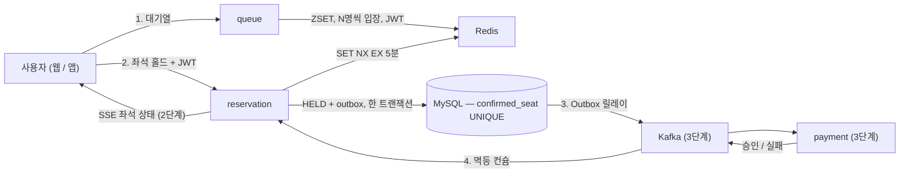

# 티켓러시 — 선착순 티켓팅 시스템


수천 명이 같은 좌석을 동시에 잡아도 **이중 예매가 0건**인 예매 시스템을 만드는 프로젝트입니다.
모놀리스로 시작해 Kafka 기반 서비스 분리까지 단계별로 키워 가고, 각 단계의 성능과 정합성을 수치로 검증합니다.

혼자 예매 흐름을 연습하는 시뮬레이터가 아닙니다. 여러 사용자가 경합하는 상황에서 데이터가 깨지지 않는다는 걸
테스트와 부하 수치로 증명하는 데 목적이 있습니다.

## 핵심 아이디어 — 좌석을 지키는 세 겹의 방어

같은 좌석을 두 사람이 가져가는 사고를 세 겹으로 막습니다.

| 겹 | 무엇 | 성격 |
|---|---|---|
| 1차 | Redis `SET NX EX` 선점 (5분 TTL) | 빠르다. 동시 요청 중 한 명만 통과시킨다. 대신 Redis가 죽으면 사라진다 |
| 2차 | 도메인 규칙 — 만료된 홀드는 결제를 거부 | 홀드가 먼저 사라져 다른 사람이 좌석을 잡았을 가능성을 걸러낸다 |
| 최종 | DB `confirmed_seat`의 (회차, 좌석) PK | Redis가 통째로 죽어도 같은 좌석의 두 번째 확정 INSERT는 DB가 물리적으로 거부한다 |

"Redis가 죽은 상황"을 통합 테스트에서 실제로 재현해, 같은 좌석에 홀드가 두 건 생겨도 확정은 정확히 한 건만
남는 것까지 확인합니다.

## 예매 흐름



대기열에 줄을 서고 → 좌석을 5분간 선점하고 → 결제하면 확정됩니다. 5분 안에 결제하지 않으면 좌석은
자동으로 풀립니다. 1단계에서 결제는 mock 어댑터의 동기 호출이고, 3단계에서 이벤트 기반으로 바뀝니다 —
이 교체가 헥사고날 아키텍처를 쓰는 이유이기도 합니다.

## 로드맵과 진행 상황

| 단계 | 내용 | 상태 | 태그 |
|---|---|---|---|
| 1 | 백엔드 뼈대 — 모놀리스 + 헥사고날 (catalog / queue / reservation) | **완료** | `v1-monolith` |
| 2 | 웹 프론트 — 모바일 웹, Canvas 좌석맵, SSE | 디자인 프로토타입 완성 | `v2-web` |
| 3 | 서비스 분리 + Kafka — Outbox 릴레이, 멱등 컨슈머, 결제 되돌리기 | | `v3-msa` |
| 4 | 부하 수치 + 가상 경쟁자 데모 | | `v4-bench` |
| 5 | 모바일 앱 (Expo) | | `v5-app` |

### 1단계에서 만든 것

- **catalog 모듈** — 공연 목록·상세, 좌석 배치(ETag + 불변 캐시), 좌석 상태 비트맵 API.
  2,000석의 상태를 좌석당 2비트로 압축해 500바이트로 내려줍니다
- **reservation 모듈** — 상태 전이 규칙은 순수 자바 도메인에, 좌석 홀드(Redis 선점 → DB 기록 →
  실패 시 되돌리기)·확정(mock 결제 + `confirmed_seat` UNIQUE)·만료 스케줄러·취소는 유스케이스로.
  이벤트 4종은 Outbox 테이블에 같은 트랜잭션으로 기록
- **queue 모듈** — ZSET 대기열(재진입해도 자리 유지), 1초마다 N명씩 입장, 10분짜리 JWT 입장권.
  reservation은 입장권의 서명만 검증해서 queue를 호출하지 않습니다 — 3단계 분리 대비
- **REST API + 멱등 처리** — 예매 API 4개와 대기열 API 2개. 상태를 바꾸는 요청은
  Idempotency-Key로 중복 실행을 막습니다(같은 키면 저장된 응답 재생)
- **동시성 증명** — 1석 100요청 동시 발사 → 성공 정확히 1건(48ms). Redis가 죽어 홀드가 중복된
  상황에서도 동시 확정의 승자는 1명 — 이중 예매 0건
- **아키텍처 검증 + CI** — ArchUnit 의존 방향 3규칙과 Spring Modulith 모듈 경계 검사(위반 0건),
  push마다 GitHub Actions에서 전체 테스트 55개 실행

## 기술 스택

Java 21 · Spring Boot 4.0 · Spring Modulith 2.0 · MySQL 8 (Flyway) · Redis 7 · Testcontainers ·
(3단계부터) Kafka · (2단계부터) Next.js

왜 이 조합인지는 [결정 기록](docs/adr/)에 남겨져 있습니다. 예: [NestJS 대신 Java/Spring을 고른 이유](docs/adr/0001-java-spring-over-nestjs.md),
[경합 테이블에 FK를 걸지 않은 이유](docs/adr/0003-no-fk-on-contention-tables.md).

## 수치 (4단계에서 채웁니다)

| 항목 | 결과 |
|---|---|
| 부하 중 중복 예매 | — 건 (목표 0) |
| 홀드 API p99 (동시 10,000 요청) | — ms |
| 처리량 | — req/s |
| 대기열 없음 vs 있음 — DB 에러율 | — % vs — % |
| `SET NX` vs Redisson vs DB 비관적 락 — p99 | — / — / — ms |
| Lighthouse 모바일 / LCP / INP | — / — s / — ms |
| SSE diff 페이로드 (2,000석) | — bytes |
| 앱 콜드 스타트 (중급 안드로이드) | — s |

## 실행

```bash
docker compose --profile infra up -d      # MySQL(호스트 3307), Redis
cd backend
./gradlew test                            # 전체 테스트 (Docker 필요 — Testcontainers)
./gradlew bootRun                         # http://localhost:8080
```

```bash
curl http://localhost:8080/api/events     # 시드된 공연 목록 확인
```

## 문서

- [설계 문서](docs/ARCHITECTURE.md) — 구성도, 스택, 코드 구조, 도메인, 이벤트, API, 인프라, 면접 포인트, 용어집
- [디자인 파운데이션](docs/design/design-foundation.md) — 디자인 토큰과 화면 문법, [동작하는 프로토타입](docs/design/gate1-prototype.html) 포함
- [결정 기록 (ADR)](docs/adr/) · [백로그](docs/backlog.md) · 에이전트 작업 규칙: [CLAUDE.md](CLAUDE.md)
