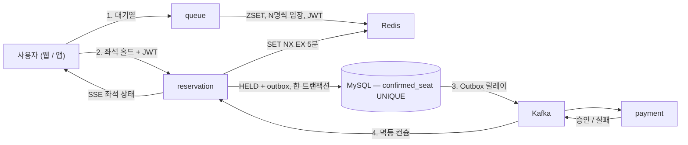

# 선착순 티켓팅 (ticketing)

수천 명이 같은 좌석을 동시에 잡아도 **이중 예매 0건**을 보장하는 예매 시스템.
헥사고날 아키텍처 + DDD로 시작해 Kafka 기반 서비스 분리까지 **단계별로 진화**시키고, 각 단계를 **수치로 검증**한다.

> 티켓팅 연습 사이트가 아니다. 혼자 흐름을 연습하는 시뮬레이터가 아니라, 다중 사용자 경합에서 정합성을 지키는 시스템이다.
> `?demo=1`로 열면 가상 경쟁자들이 같이 좌석을 잡는 걸 실시간으로 볼 수 있다. (4단계)

## 핵심 세 가지

1. **Redis 홀드 + DB UNIQUE 이중 방어** — Redis가 죽어도 같은 좌석이 두 번 확정되지 않는다.
2. **모놀리스 → 서비스 분리의 진화 과정이 태그로 남아 있다** — `v1-monolith` → `v3-msa`. 왜 처음부터 MSA가 아니었는지 커밋이 답한다.
3. **모든 설계 결정에 수치가 붙어 있다** — 락 방식 비교, 대기열 유무별 에러율, 모바일 LCP/INP. (아래 표)

## 구성도

<!-- docs/ARCHITECTURE.md 2-1의 mermaid를 여기 붙이거나 FigJam 이미지를 넣는다 -->



## 로드맵

| 단계 | 내용 | 상태 | 태그 |
|---|---|---|---|
| 1 | 백엔드 뼈대 (모놀리스 + 헥사고날, catalog/queue/reservation) | 진행 중 | `v1-monolith` |
| 2 | 웹 프론트 (모바일 웹, Canvas 좌석맵, SSE) | | `v2-web` |
| 3 | 서비스 분리 + Kafka (Outbox, 멱등, 되돌리기, 푸시 이벤트) | | `v3-msa` |
| 4 | 부하·성능 수치 + 가상 경쟁자 데모 | | `v4-bench` |
| 5 | 모바일 앱 (Expo) | | `v5-app` |

## 수치 (4단계에서 채운다)

| 항목 | 결과 |
|---|---|
| 부하 중 중복 예매 | — 건 (목표 0) |
| 홀드 API p99 (동시 10,000 요청) | — ms |
| 처리량 | — req/s |
| 대기열 없음 vs 있음 — DB 에러율 | — % vs — % |
| `SET NX` vs Redisson vs DB 비관적 락 — p99 | — / — / — ms |
| Lighthouse 모바일 / LCP / INP | — / — s / — ms |
| SSE diff 페이로드 (2,000석) | — bytes |
| 앱 콜드 스타트 (중급 안드로이드) | — s |

## 실행

```bash
docker compose --profile infra up -d
cd backend && ./gradlew test && ./gradlew bootRun
# http://localhost:8080/swagger-ui.html
```

## 문서

- [설계 문서](docs/ARCHITECTURE.md) — 구성도, 스택, 코드 구조, 도메인, 이벤트, API, 웹/앱, 인프라, 면접 포인트, 용어집
- [결정 기록 (ADR)](docs/adr/) · [백로그](docs/backlog.md)
- 에이전트 작업 규칙: [CLAUDE.md](CLAUDE.md)
