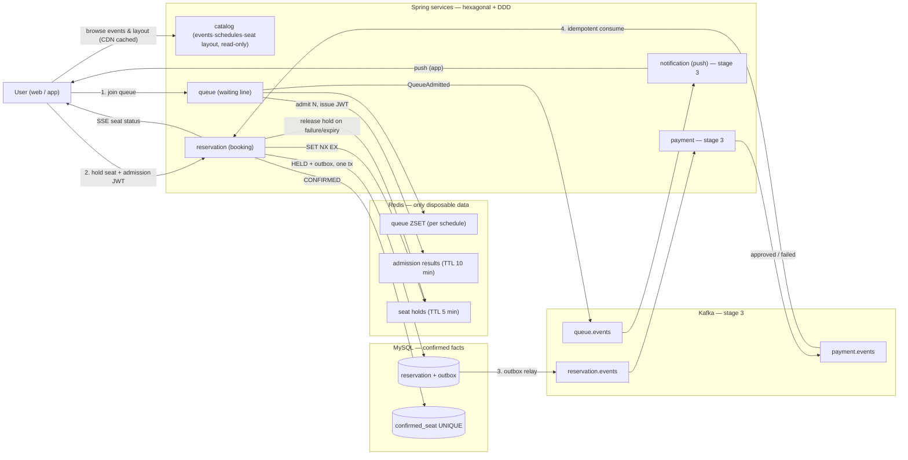
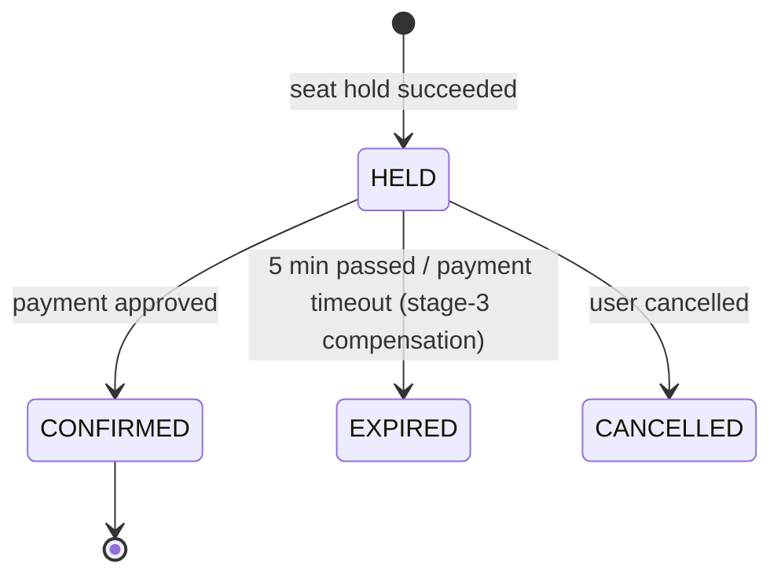

# Ticket Rush — Architecture (ARCHITECTURE.en.md)

[한국어](ARCHITECTURE.md) | **English**

> This document is the **complete design** of the project. A human reads it once end to end;
> agents read the relevant section before working. Per-session working rules and the current
> stage live in `CLAUDE.md`. If the two documents conflict, `CLAUDE.md` wins.

---

## 1. Overview

### 1-1. What and why

- **What**: a first-come-first-served seat reservation system for live events.
  Queue → seat hold → payment → confirmation. Web (mobile web) and app.
- **Why**: not a product launch but **skill acquisition + an interview portfolio**. Only
  choices a human can explain ("why this technology?") are allowed. Anything unexplainable is out.
- **Core value in one line**: even when thousands grab the same seat at once,
  **zero double-bookings**. The screens are a shell to show this off.
- **How this differs from look-alikes**: ticketing practice sites are single-user UX
  simulators. This project protects consistency under multi-user contention and
  **proves it with numbers**. The UX flow borrows from them, but the README leads with
  consistency and metrics.

### 1-2. User flow (screen order)

```
Event list → event detail (open countdown) → book button → queue (N ahead, ETA)
→ seat map (section → seat, 5-min hold countdown) → [captcha: backlog] → payment → done
```

We follow Interpark-style ticketing UX exactly — users already know it, so no explanation needed.

### 1-3. One request, system view

1. Join queue → register (schedule, user, entry time) in a Redis ZSET
2. A scheduler admits N users at a time from the front → issues an admission token
   (JWT, 10 min) → push notification on the app
3. Pick a seat → Redis hold (`SET NX EX`, 5 min) succeeds → save `HELD` in the DB + an
   outbox row (one transaction)
4. Payment approved → `CONFIRMED` in the DB + a `confirmed_seat` row
   (the UNIQUE constraint is the final defense)
5. Payment failure / hold expiry → release the hold
6. Seat state changes stream to web/app via SSE

### 1-4. Roadmap

| Stage | What | Done when | Tag |
|---|---|---|---|
| 1 | Backend skeleton. One app with `catalog` (read-only) + `queue` + `reservation`. Payment is a mock adapter called **synchronously** | queue/hold/confirm/expire APIs, 100 requests for 1 seat → 1 success, Testcontainers integration tests, ArchUnit·Modulith checks | `v1-monolith` |
| 2 | Web frontend (mobile web) | list/detail/queue/seat-map (Canvas)/payment screens, SSE realtime, README GIF | `v2-web` |
| 3 | Service split + Kafka | `payment` split (sync call → events), outbox, idempotent consumers, compensation, `queue` split, `notification`, tracing | `v3-msa` |
| 4 | Numbers + demo | k6 load tests, lock-strategy comparison, queue on/off comparison, Lighthouse mobile, **virtual-competitor demo mode** | `v4-bench` |
| 5 | Mobile app | Expo app. Logic shared with web, Skia seat map, admission push, deep links | `v5-app` |

---

## 2. Big picture

### 2-1. Diagram (stage-3 target shape; parts fill in per stage)



### 2-2. Reservation states



- `CONFIRMED` is terminal. Any other transition is a domain exception.
- A payment **decline** (card limit etc.) keeps `HELD` — retry within the 5 minutes.
  A payment **timeout** (no response) becomes a stage-3 compensation target.

### 2-3. How confirmation evolves (the contrast to present in interviews)

| | Stage 1 | Stage 3 |
|---|---|---|
| Payment call | `PaymentGateway.approve()` **synchronous** (mock adapter) | `ReservationHeld` event → payment service → `PaymentApproved` event |
| Failure handling | exception → transaction rollback | `PaymentFailed`/timeout → release hold + `EXPIRED` (compensation) |
| Pros | simple, easy to debug | slow payments don't block the reservation service; independent deploys |
| Cost | slow payment ties up a reservation thread | outbox, idempotency, and compensation code required |

---

## 3. Repository layout

```
ticketing/
├── CLAUDE.md               # agent working rules + current stage (every session)
├── AGENTS.md               # for Codex: one line, "follow CLAUDE.md"
├── README.md               # intro, diagram, roadmap, numbers
├── backend/                # Spring Boot (Gradle), from stage 1
├── apps/web/               # Next.js, stage 2
├── apps/mobile/            # Expo (React Native), stage 5
├── packages/
│   ├── api-client/         # types generated from OpenAPI + fetch wrapper (web·app shared)
│   └── seat-map-core/      # layout parsing, bitmap decoding, hit tests (renderer-agnostic pure TS)
├── load/                   # k6 scenarios, stage 4
├── docs/
│   ├── ARCHITECTURE.md     # this document
│   ├── adr/                # decision records
│   ├── backlog.md          # out-of-stage ideas
│   └── interview.md        # expected questions (human-maintained)
└── docker-compose.yml      # profiles: infra / stage3 / web
```

---

## 4. Backend

### 4-1. Stack (ask a human before adding anything not listed)

| Area | Choice | Why |
|---|---|---|
| Language | Java 21 | LTS; virtual-thread experiments possible (stage 4). Why not NestJS: `docs/adr/0001` |
| Framework | Latest stable Spring Boot | industry standard; version recorded in an ADR |
| Module boundaries | Spring Modulith | package boundaries **enforced by tests**; boundaries already exist when services split in stage 3 |
| Build | Gradle (Kotlin DSL) | single project in stages 1–2, per-service subprojects in stage 3 |
| DB | MySQL 8 + Spring Data JPA + Flyway | schema changes managed as files; `ddl-auto` is `validate` only |
| Redis | Redis 7 + Spring Data Redis (Lettuce) | holds, queue, admission results, idempotency keys |
| Messaging (stage 3) | Kafka (KRaft) + Spring Kafka | publish/subscribe, retries, DLT |
| External-call protection (stage 3) | Resilience4j | timeout/retry/circuit-breaker on the PG call |
| Observability (stages 3–4) | Actuator + Micrometer → Prometheus/Grafana, OpenTelemetry → Tempo | trace several services under one traceId |
| API docs | springdoc-openapi | the source for web/app type generation (section 8) |
| Testing | JUnit 5, AssertJ, Testcontainers, ArchUnit | real DB·Redis in tests; architecture rules as tests |
| Load (stage 4) | k6 | scenarios live as code; reused for demo mode |
| Infra | Docker Compose (profiles), GitHub Actions | tests on every push |

**Deliberately not used** — login/membership (`X-User-Id` header), Kubernetes (no
scale-based justification), API Gateway/Eureka (optional in stage 3, ADR if added),
Avro/Schema Registry (JSON + `version` field), MongoDB/Elasticsearch (no problem that needs them).

### 4-2. Code structure — hexagonal = "pure Java inside, adapters outside"

One line: **the domain (rules) knows nothing about Spring; Spring/DB/Redis/Kafka appear only in adapters.**

```
backend/src/main/java/com/ticketing
├── catalog/                    # module (stage 1) — events·schedules·layout. read-only, Flyway seed
├── queue/                      # module (stage 1) — waiting line, admission JWT issuing
├── reservation/                # module (stage 1) — booking. the thickest module
│   ├── domain/                 # Reservation, state transitions, domain events. pure Java (no Spring/JPA imports)
│   ├── application/
│   │   ├── port/in/            # capabilities offered = use-case interfaces (HoldSeatUseCase, ConfirmReservationUseCase, ExpireHoldUseCase, CancelReservationUseCase)
│   │   ├── port/out/           # needs from the outside = interfaces (ReservationRepository, SeatHoldStore, PaymentGateway, EventPublisher, AdmissionTokenVerifier)
│   │   └── service/            # use-case implementations. @Transactional lives here
│   └── adapter/
│       ├── in/web/             # REST controllers + DTOs
│       ├── in/scheduler/       # expiry scheduler
│       ├── in/messaging/       # (stage 3) Kafka consumers
│       ├── out/persistence/    # JPA entities, repository impls, outbox
│       ├── out/redis/          # SeatHoldStore implementation
│       ├── out/payment/        # MockPaymentGatewayAdapter (configurable delay/failure rate)
│       └── out/messaging/      # (stage 3) Kafka publishing
├── payment/                    # module (stage 3)
├── notification/               # module (stage 3) — push consumer
└── shared/                     # event envelope, common exceptions, Idempotency-Key handling. no domain logic
```

`queue`, `catalog`, `payment`, and `notification` follow the same
`domain / application / adapter` shape. Small modules may flatten sub-packages, but the
dependency direction is identical.

**Directions to keep** — enforced by ArchUnit + `ApplicationModules.verify()`

- `adapter → application → domain`, one way. Reverse imports are banned.
- `domain` must not import `org.springframework..`, `jakarta.persistence..`, `com.fasterxml..`.
- Modules talk to each other only via the other side's `port/in` (use cases) or events.
  Direct references to another module's `domain`/`adapter` are banned. Externally exposed
  types use `@NamedInterface`.
- **JPA entities and domain objects are different classes**, converted in adapters.
  (Why: don't bend domain rules to fit DB concerns.)
- Cross-module calls are minimized by design: the admission token is a JWT signed by
  `queue`, and `reservation` **verifies only the signature** — so splitting `queue` out
  in stage 3 changes no reservation code.

**Naming** — use case `VerbNounUseCase` → implementation `~Service`. Out ports are role names
(`SeatHoldStore`) → implementations `Redis~Adapter` / `Jpa~Adapter` / `Mock~Adapter`.
Events are past tense (`ReservationHeld`). Tests are `~Test` (unit),
`~IntegrationTest` (Testcontainers), `~ConcurrencyTest`.

### 4-3. Domain rules

**Reservation** — `id, scheduleId, seatId, userId, status, expiresAt, version (optimistic lock), createdAt`

- Transitions per 2-2, implemented only inside domain methods (`confirm()`, `expire()`, `cancel()`).
- `confirm()` rejects when `expiresAt` has passed (the Redis hold may have expired first and
  someone else may hold the seat).
- Invariant: at most one live confirmation per (schedule, seat) — guaranteed not by code but
  by the DB constraint `confirmed_seat(schedule_id, seat_id) UNIQUE`.
- Stage 1 is **one seat per request**. Multi-seat holds (Lua script) are backlog.

**Seat hold**

- Redis `hold:{scheduleId}:{seatId}` = holder, `SET NX EX 300`.
- Order: Redis hold succeeds → save `HELD` + outbox row in one DB transaction → if the DB
  fails, delete the Redis hold immediately.
- On confirm: domain `confirm()` → insert into `confirmed_seat` (UNIQUE) → delete the Redis
  hold. A UNIQUE violation is answered as a confirmation failure.

**Expiry**

- 1st layer: after the 5-minute Redis TTL the seat can be taken again.
- 2nd layer: every 10 s a scheduler flips `status = HELD AND expires_at < now` to `EXPIRED`
  in batches of 100 and deletes hold keys (ignoring missing ones).
- Redis keyspace notifications can be lost, so they are not used (ADR required if added as a supplement).

**Queue**

- Join: `ZADD NX queue:{scheduleId} <now_ms> <userId>`. Position via `ZRANK`.
- Admission: every second a scheduler pops N (default 100, configurable) via `ZPOPMIN`,
  issues a JWT (scheduleId, userId, exp 10 min) → `admitted:{scheduleId}:{userId}` = JWT, TTL 10 min.
- Clients: stage 1 polls `GET .../queue/me` (2-s backoff); SSE from stage 2.
- N values and DB error rates with/without the queue are stage-4 comparison items.

**Redis vs DB — when in doubt, come back to these two lines**

- Redis: only disposable data (queue, holds, admission results, idempotency keys). Every key has a TTL.
- DB: confirmed facts. **Even if Redis dies, the same seat must never be confirmed twice.**

### 4-4. Tables — Flyway `V1__init.sql`, `V2__seed.sql`. The application never creates tables

| Stage | Tables | Notes |
|---|---|---|
| 1 | `event(id, title, venue, open_at)` `schedule(id, event_id, starts_at)` `section(id, schedule_id, name, seat_count)` `seat(id, section_id, row_no, col_no)` | catalog. Seed: 1 event, 1 schedule, 4 sections × 500 seats = 2,000 |
| 1 | `reservation(id, schedule_id, seat_id, user_id, status, expires_at, version, created_at)` | index `(status, expires_at)` |
| 1 | `confirmed_seat(schedule_id, seat_id, reservation_id)` | **UNIQUE(schedule_id, seat_id)** |
| 1 | `outbox(id, aggregate_type, aggregate_id, event_type, payload JSON, created_at, published_at NULL)` | index `(published_at, created_at)` |
| 3 | `payment(id, reservation_id, amount, status, pg_tx_id, created_at)` | |
| 3 | `processed_event(consumer, event_id, processed_at)` | PK `(consumer, event_id)` |
| 3 | `device_token(user_id, token, platform, updated_at)` | push |

### 4-5. Event rules (applied in stage 3; stages 1–2 use in-app events only)

- Stages 1–2: `ApplicationEventPublisher` + the Modulith event log (`event_publication`).
  "Write to the DB first, send later" — the same principle as the outbox.
- Stage-3 outbox relay: **hand-rolled polling** (1 s, 100 rows where `published_at IS NULL`,
  set `published_at` after publishing) as the default, compared against
  `spring-modulith-events-kafka` externalization in an ADR.
- Envelope: `{eventId(UUID), eventType, version, occurredAt, aggregateId, payload}`
- Topics: `reservation.events`, `payment.events`, `queue.events`. Partition key = `scheduleId`
  (ordering per schedule; the hot-partition trade-off for popular schedules goes in an ADR).
- Consumers: insert into `processed_event` first (skip on duplicate) → process → commit in
  the same transaction. On failure retry (3× backoff) → DLT.
- Compensation: `PaymentFailed` (timeout) → `ExpireHoldUseCase` → release hold + `EXPIRED`.
  An event chain with no central orchestrator.
- Push: `queue` publishes `QueueAdmitted` → `notification` looks up `device_token` → Expo Push.
- SSE fan-out: with multiple instances, seat-status changes go through Redis Pub/Sub
  (`seat-status:{scheduleId}`) to every instance → each pushes to its own SSE clients.

---

## 5. API draft

Under `/api`. Auth is the `X-User-Id` header (a deliberate out-of-scope simplification);
from seat-hold onward also `Authorization: Bearer <admission JWT>`.

| Stage | Method | Path | Description |
|---|---|---|---|
| 1 | GET | `/events`, `/events/{id}` | event list/detail (catalog) |
| 2 | GET | `/schedules/{id}` | schedule detail + event summary. lets the payment/done screens walk back reservation → schedule → event |
| 1 | GET | `/schedules/{id}/seats/layout` | seat layout. static, `Cache-Control: immutable` + ETag |
| 1 | GET | `/schedules/{id}/seats/status` | seat-status bitmap (8-3) |
| 1 | POST | `/schedules/{id}/queue` | join queue → `{position}` |
| 1 | GET | `/schedules/{id}/queue/me` | `{position, admitted, token?}` |
| 1 | POST | `/reservations` | `{scheduleId, seatId}` + Bearer + `Idempotency-Key` → 201 `{reservationId, expiresAt}` |
| 1 | POST | `/reservations/{id}/confirm` | pay → confirm. sync in stage 1; event-driven in stage 3 (202 then SSE/poll) |
| 1 | DELETE | `/reservations/{id}` | cancel |
| 1 | GET | `/reservations/{id}` | fetch |
| 2 | GET | `/schedules/{id}/queue/stream` | SSE position/admission |
| 2 | GET | `/schedules/{id}/seats/stream` | SSE seat-status changes |
| 2 | POST | `/rum` | Web Vitals collection |
| 5 | POST | `/devices` | push-token registration |

Errors are RFC 9457 Problem Details (`application/problem+json`). Example codes:
`SEAT_ALREADY_HELD`, `HOLD_EXPIRED`, `ADMISSION_REQUIRED`, `IDEMPOTENCY_CONFLICT`.

---

## 6. Web frontend — `apps/web`, stage 2

**Stack** — Next.js (App Router) + TypeScript, TanStack Query, Tailwind. Realtime via SSE (`EventSource`).

**Per-screen strategy — "the server draws the first paint, the browser handles interaction"**

| Screen | Approach | Why |
|---|---|---|
| Event list·detail | server-rendered HTML first (SSR/ISR). BFF composes detail + remaining-seat summary | mobile first-paint speed (LCP) |
| Queue | client-only + SSE, polling on disconnect | the position keeps changing |
| Seat map | client-only, lazy `next/dynamic(ssr:false)`. **Canvas** (≤5k seats) / PixiJS above | thousands of DOM seats kill low-end phones |
| Payment | mock card form, one button | completes the flow |

**Performance rules — mobile-first**

- Seat **layout** (static, large) and **status** (small, frequent) are separate APIs.
  Layout is CDN-cached forever under a hashed URL.
- SSE sends diffs only, batched 200–500 ms server-side. `Last-Event-ID` resume, 15-s
  heartbeats, reconnect on `visibilitychange`.
- Hold/confirm requests carry `Idempotency-Key` (mobile sends duplicates).
- Tapping a seat shows "holding…" immediately (optimistic UI), rolled back on failure.
  Hold countdown. Buttons disabled while in flight.
- Initial JS budget 150–200 KB (gz), `size-limit` in CI. Seat map is a separate chunk.
  Pretendard subset via `next/font`. `next/image`.
- Touch: Pointer Events, `touch-action: none` on the seat map, CTA pinned in the thumb zone,
  bottom sheets, `safe-area-inset`.
- Measurement: `web-vitals` → `/rum` → Grafana. Lighthouse CI (mobile preset, 4G throttle).
  Targets: LCP 2.5 s, INP 200 ms.

**Demo mode (stage 4)** — with `?demo=1`, the server attaches N virtual competitors
(k6 or `@Profile("demo")` bots) so seats visibly disappear in real time. Contention should
be visible the moment an interviewer opens the link.

---

## 7. Mobile app — `apps/mobile`, stage 5

**Why an app too** — queue-admission alerts need **background push**; web push is unreliable
on iOS (requires home-screen install). An app makes it certain. How much code web and app can
share is itself a learning goal.

**Stack**

| Area | Choice | Why |
|---|---|---|
| Framework | Expo (React Native) + TypeScript | reuse React knowledge; share TS with web |
| Build | EAS dev build | push requires a dev build (Expo Go is limited) |
| Seat map | `@shopify/react-native-skia` + gesture-handler + Reanimated | canvas rendering + 60 fps gestures |
| Server state | TanStack Query (same as web) | shared cache logic |
| Realtime | foreground SSE (`react-native-sse`), background via push | apps lose connections in background |
| Push | expo-notifications + Expo Push API | FCM/APNs behind one API |
| Storage | expo-secure-store | no plain-text tokens |
| Lists/images | FlashList, expo-image | scroll performance, image cache |

**Shared with web / not shared**

- Shared (`packages/`): `api-client`, `seat-map-core` (renderer-agnostic pure TS), queue/hold hooks.
- Not shared: UI components. Web uses DOM/Canvas, app uses RN/Skia. No forced sharing via
  react-native-web (seat-map performance diverges).
- In other words, "core logic doesn't know the renderer" — the same idea as backend hexagonal.

**App-only features** — push-token registration (`POST /devices`) → `QueueAdmitted` → push →
tap deep-links (`ticketing://event/{id}` + universal links) into the seat map. Network flakiness
is handled by `Idempotency-Key` retries; offline gets a clear error, not queuing.

**Performance targets** — cold start ≤ 2 s, first render of a 2,000-seat map ≤ 500 ms
(mid-range Android), 60 fps JS thread during gestures.

---

## 8. Contracts shared by web, app, and backend

### 8-1. API types
Backend springdoc → `openapi.json` → `openapi-typescript` → `packages/api-client`.
No hand-written types. CI regenerates and fails on diff.

### 8-2. Idempotency keys
State-changing requests (hold, confirm, pay) require `Idempotency-Key: <uuid>`. The server
stores the response at `idem:{userId}:{key}` (TTL 24 h) and replays it for the same key.
Same key with a different body → `409 IDEMPOTENCY_CONFLICT`.

### 8-3. Seat-status bitmap
A `Uint8Array` per section, 2 bits per seat: `00` free, `01` held, `10` confirmed,
`11` blocked. Order follows the layout JSON. 2,000 seats = 500 bytes. Web and app both
decode via `seat-map-core`.

### 8-4. SSE
`event: seat-status`, `id: <monotonic>`,
`data: {"scheduleId":1,"sectionId":2,"changes":[{"seatId":17,"status":1}]}`.
Heartbeat is a `: ping` comment every 15 s.

### 8-5. Auth (out of scope, simplified)
`X-User-Id` header. Admission token via `Authorization: Bearer <JWT>` (HS256, secret from
env, 10 min).

---

## 9. Infrastructure

```
[web/app users] → Cloudflare (CDN, HTTP/3, cache, bot blocking, rate limits) → Cloudflare Tunnel
   → Caddy (TLS, reverse proxy) → Next.js (SSR + BFF) ──→ Spring services → MySQL / Redis / Kafka
                                   └ SSE bypasses Next and connects to Spring directly
```

- Cloudflare free tier: caches static assets and the seat-layout JSON, blocks bots,
  rate-limits the hold endpoint. Tunnel means no open ports on a home server.
- Caddy: automatic TLS. **Disable buffering for SSE** (`flush_interval -1`) — a classic trap.
- BFF: a Next.js route handler composes event detail + remaining-seat summary in one call.
  The app uses the same endpoint.
- Three bot-defense layers: edge rate limits (Cloudflare) + app rate limits (Bucket4j/Redis,
  per user·IP) + [captcha: backlog]. `Idempotency-Key` guards against duplicates.
- Compose profiles: `infra` (MySQL, Redis) / `stage3` (+Kafka, Prometheus, Grafana, Tempo) / `web` (Next.js).
- CI: GitHub Actions — `gradlew test` (Testcontainers); from stage 2 also `pnpm test` +
  Lighthouse CI + `gen:api` diff check.

---

## 10. Test & measurement strategy

| Kind | Target | Tool | Stage |
|---|---|---|---|
| Unit | domain (no Spring) | JUnit 5, AssertJ | 1 |
| Architecture | dependency direction, module boundaries | ArchUnit, `ApplicationModules.verify()` | 1 |
| Integration | adapters (real MySQL·Redis·Kafka) | Testcontainers | 1 / 3 |
| Concurrency | 100 requests for 1 seat → 1 success; confirm UNIQUE collision | `ExecutorService` + `CountDownLatch` | 1 |
| Contract | OpenAPI ↔ generated types diff | CI | 2 |
| E2E | queue → seat → payment (mobile emulation) | Playwright | 2 |
| Load | 10,000 concurrent hold requests; queue on/off and N values; lock strategies | k6 | 4 |
| Frontend perf | LCP/INP, bundle size, 2,000-seat first render | Lighthouse CI, web-vitals, size-limit | 4 |
| App perf | cold start, seat-map render, gesture FPS | Expo dev build + profiler | 5 |

**Numbers for the README** — zero double-bookings under load, hold p99, throughput,
DB error rate with vs. without the queue, `SET NX` vs Redisson vs DB pessimistic locking,
Lighthouse mobile score, LCP/INP, SSE diff payload size, app cold start.

---

## 11. Interview notes — design decisions and trade-offs

Where the "why?" questions land. Each is backed by an ADR or a README number.

1. **Why ticketing, not a bulletin board** — concurrency, state transitions, and external
   integration are baked into the domain, making this architecture inevitable.
2. **Redis hold + DB UNIQUE double defense** — what if Redis dies? Holds vanish, but the
   UNIQUE constraint still blocks double confirmation.
3. **Lock choice** — `SET NX EX` vs Redisson vs DB pessimistic lock, decided by numbers (stage 4).
4. **Outbox** — DB commit vs event publish divergence. Polling vs CDC (Debezium) vs Modulith externalization.
5. **Idempotent consumers** — at-least-once delivery; why `processed_event` shares the transaction.
6. **Compensation (saga)** — choreography vs orchestrator; with three services, the former.
7. **Partition key = scheduleId** — ordering vs hot partitions for popular schedules.
8. **Expiry handling** — lossy keyspace notifications vs scheduler; Redis TTL (1st) + DB scheduler (2nd).
9. **Monolith → split timing** — why not MSA from day one; the tag history is the evidence.
10. **The cost of hexagonal** — more mapping code and interfaces; accepted for testability
    and adapter swaps.
11. **Why the admission token is a JWT** — removes cross-module calls → zero code changes at split time.
12. **The queue** — ZSET ordering, choosing admission rate N, DB error rate without a queue.
13. **Bot defense** — double rate limits, captcha, idempotency keys.
14. **Canvas seat map** — DOM limits, bitmap status format, SSE vs WebSocket, optimistic UI.
15. **Web/app code-sharing boundary** — share logic, not UI.
16. **Java vs NestJS** — `docs/adr/0001`.

---

## 12. Glossary — for first encounters

| Term | Meaning |
|---|---|
| Hexagonal | rules (domain) in the middle, frameworks/DB/external systems outside (adapters). Swapping the outside doesn't change the middle |
| Port / adapter | port = interface; adapter = its implementation (controller, JPA, Redis, Kafka, PG client) |
| Use case | one capability such as "hold a seat" = an inbound port |
| Aggregate | a cluster of objects saved/validated together in one transaction, accessed via its root |
| Bounded context | a boundary that could later become a service; here, one Modulith module |
| Outbox | write events to a DB table first; a separate job ships them to Kafka. Solves "saved but never published" |
| Idempotent | processing the same request/message twice equals processing it once |
| Saga / compensation | a multi-service operation advanced by an event chain, with earlier steps undone on failure |
| DLT | a topic collecting messages that still fail after retries |
| Optimistic lock | a `version` column detects "someone changed it after I read it"; conflict = failure |
| At-least-once | delivery guaranteed at least once = duplicates possible, hence idempotency |
| SSE | one-way server→client realtime stream over plain HTTP, with auto-reconnect |
| BFF | a server layer that shapes API responses per screen (here, the Next.js server) |
| ISR | server-rendered HTML cached for a period, then refreshed |
| LCP / INP | time to the largest first-paint element / input responsiveness — mobile metrics |
| Problem Details | the standard error format (RFC 9457) |
| ADR | an architecture decision record — ten lines of "why" |
