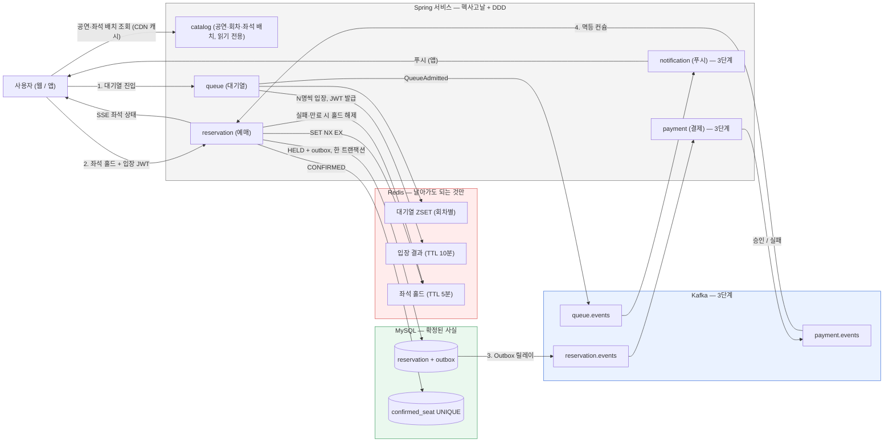
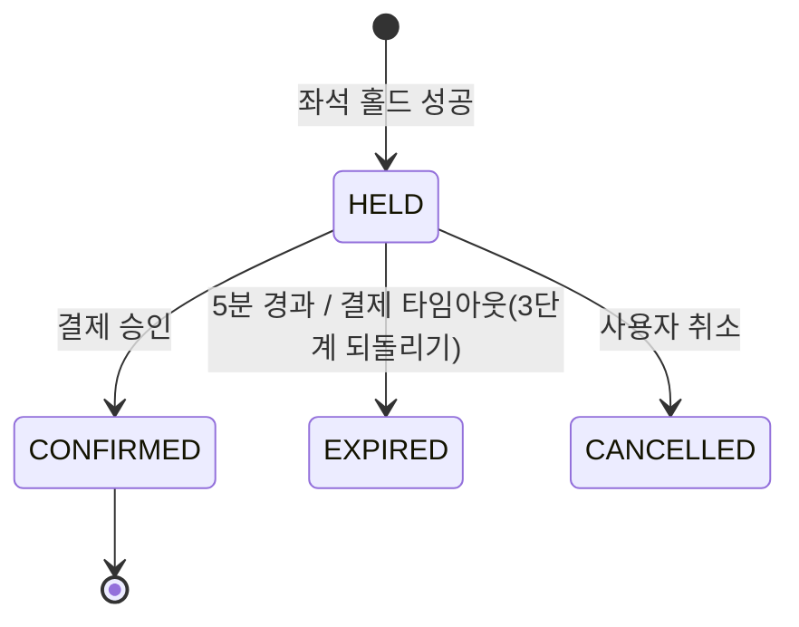

# 선착순 티켓팅 — 설계 문서 (ARCHITECTURE.md)

**한국어** | [English](ARCHITECTURE.en.md)

> 이 문서는 프로젝트의 **설계 전체**다. 사람은 처음 한 번 통독하고, 에이전트는 작업 전에 관련 절만 읽는다.
> 매 세션의 작업 규칙과 현재 단계는 `CLAUDE.md`에 있다. 두 문서가 어긋나면 `CLAUDE.md`가 이긴다.

---

## 1. 개요

### 1-1. 무엇을, 왜

- **무엇**: 공연 좌석을 선착순으로 예매하는 시스템. 대기열 → 좌석 홀드 → 결제 → 확정. 웹(모바일 웹 포함)과 앱.
- **왜**: 서비스 출시가 아니라 **기술 습득 + 면접 포트폴리오**. 그래서 "왜 이 기술을 썼는가"를 사람이 설명할 수 있는 선택만 한다. 설명 못 하는 기술은 넣지 않는다.
- **핵심 가치 한 줄**: 수천 명이 같은 좌석을 동시에 잡아도 **이중 예매 0건**. 화면은 이걸 보여주는 껍데기다.
- **비슷해 보이는 것과의 차이**: 티켓팅 연습 사이트(프랙티켓 등)는 혼자 흐름을 연습하는 UX 시뮬레이터다. 이 프로젝트는 다중 사용자 경합에서 정합성을 지키고 **수치로 증명**하는 시스템이다. UX 흐름은 그쪽을 참고하되 README는 정합성·수치를 앞세운다.

### 1-2. 사용자 흐름 (화면 순서)

```
공연 목록 → 공연 상세(오픈 카운트다운) → 예매 버튼 → 대기열(앞에 N명, 예상 시간)
→ 좌석맵(구역 → 좌석, 홀드 5분 카운트다운) → [보안문자: backlog] → 결제 → 완료
```

인터파크 계열 티켓팅 UX를 그대로 따른다. 사용자가 이미 아는 흐름이라 설명이 필요 없다.

### 1-3. 요청 한 번의 흐름 (시스템 관점)

1. 대기열 진입 → Redis ZSET에 (회차, 사용자, 진입 시각) 등록
2. 스케줄러가 앞에서 N명씩 입장 허용 → 입장 토큰(JWT, 10분) 발급 → 앱이면 푸시
3. 좌석 선택 → Redis에 홀드(`SET NX EX`, 5분) 성공 → DB에 `HELD` 저장 + Outbox (한 트랜잭션)
4. 결제 승인 → DB에 `CONFIRMED` + `confirmed_seat` 기록 (UNIQUE 제약이 최종 방어)
5. 결제 실패·홀드 만료 → 홀드 해제
6. 좌석 상태 변경 → SSE로 웹/앱에 실시간 전달

### 1-4. 로드맵

| 단계 | 만드는 것 | 끝난 기준 | 태그 |
|---|---|---|---|
| 1 | 백엔드 뼈대. 한 앱 안에 `catalog`(읽기 전용) + `queue` + `reservation` 모듈. 결제는 mock 어댑터 **동기 호출** | 대기열/홀드/확정/만료 API, 1석 100요청 → 성공 1건, Testcontainers 통합 테스트, ArchUnit·Modulith 검증 | `v1-monolith` |
| 2 | 웹 프론트 (모바일 웹) | 목록·상세·대기열·좌석맵(Canvas)·결제 화면, SSE 실시간, README GIF | `v2-web` |
| 3 | 서비스 분리 + Kafka | `payment` 분리(동기 호출 → 이벤트), Outbox, 멱등 컨슈머, 되돌리기, `queue` 분리, `notification`, 트레이싱 | `v3-msa` |
| 4 | 수치 + 데모 | k6 부하, 락 방식 비교, 대기열 유무 비교, Lighthouse 모바일, **가상 경쟁자 데모 모드** | `v4-bench` |
| 5 | 모바일 앱 | Expo 앱. 웹과 로직 공유, 좌석맵(Skia), 대기열 입장 푸시, 딥링크 | `v5-app` |

---

## 2. 전체 그림

### 2-1. 구성도 (3단계 완성형. 회색 표시는 단계별로 채워진다)



### 2-2. 예매 상태



- `CONFIRMED`는 마지막 상태(더 못 바뀜). 다른 전이는 도메인 예외.
- 결제 **거절**(카드 한도 등)은 `HELD` 유지 — 5분 안에 재시도 가능. 결제 **타임아웃**(응답 없음)은 3단계에서 되돌리기 대상.

### 2-3. 확정 흐름의 진화 (면접에서 이 대비를 말한다)

| | 1단계 | 3단계 |
|---|---|---|
| 결제 호출 | `PaymentGateway.approve()` **동기 호출** (mock 어댑터) | `ReservationHeld` 이벤트 → 결제 서비스 → `PaymentApproved` 이벤트 |
| 실패 처리 | 예외 → 트랜잭션 롤백 | `PaymentFailed`/타임아웃 → 홀드 해제 + `EXPIRED` (되돌리기) |
| 장점 | 단순, 디버깅 쉬움 | 결제 느려도 예매 서비스 안 막힘, 서비스별 독립 배포 |
| 비용 | 결제가 느리면 예매 스레드가 잡힘 | Outbox·멱등·되돌리기 코드가 필요 |

---

## 3. 레포 구조

```
ticketing/
├── CLAUDE.md               # 에이전트 작업 규칙 + 현재 단계 (매 세션)
├── AGENTS.md               # Codex용. "CLAUDE.md를 따르라" 한 줄
├── README.md               # 소개, 구성도, 로드맵, 수치
├── backend/                # Spring Boot (Gradle). 1단계부터
├── apps/web/               # Next.js. 2단계
├── apps/mobile/            # Expo (React Native). 5단계
├── packages/
│   ├── api-client/         # OpenAPI에서 생성한 타입 + fetch 래퍼 (웹·앱 공용)
│   └── seat-map-core/      # 좌석 배치 파싱, 비트맵 디코딩, 히트 테스트 (렌더러 무관 순수 TS)
├── load/                   # k6 시나리오. 4단계
├── docs/
│   ├── ARCHITECTURE.md     # 이 문서
│   ├── adr/                # 결정 기록
│   ├── backlog.md          # 단계 밖 아이디어
│   └── interview.md        # 예상 질문 (사람이 관리)
└── docker-compose.yml      # profile: infra / stage3 / web
```

---

## 4. 백엔드

### 4-1. 스택 (이 밖의 라이브러리는 추가 전에 사람에게 묻는다)

| 영역 | 선택 | 왜 |
|---|---|---|
| 언어 | Java 21 | LTS. 가상 스레드 실험 가능(4단계). NestJS 대신 고른 이유는 `docs/adr/0001` |
| 프레임워크 | Spring Boot 최신 안정판 | 실무 표준. 버전은 ADR에 기록 |
| 모듈 경계 | Spring Modulith | 패키지 경계를 **테스트로 강제**. 3단계에 서비스로 쪼갤 때 경계가 이미 있음 |
| 빌드 | Gradle (Kotlin DSL) | 1~2단계 단일 프로젝트, 3단계에 서비스별 서브프로젝트 |
| DB | MySQL 8 + Spring Data JPA + Flyway | 테이블 변경을 파일(마이그레이션)로 관리. `ddl-auto`는 `validate`만 |
| Redis | Redis 7 + Spring Data Redis (Lettuce) | 홀드, 대기열, 입장 결과, 멱등 키 |
| 메시징 (3단계) | Kafka (KRaft) + Spring Kafka | 이벤트 발행/구독, 재시도, DLT |
| 외부 호출 보호 (3단계) | Resilience4j | PG 호출에 타임아웃·재시도·서킷브레이커 |
| 관측 (3~4단계) | Actuator + Micrometer → Prometheus/Grafana, OpenTelemetry 트레이싱 → Tempo | 서비스 여럿을 traceId 하나로 추적 |
| API 문서 | springdoc-openapi | 웹/앱 타입 자동 생성의 원본 (8절) |
| 테스트 | JUnit 5, AssertJ, Testcontainers, ArchUnit | 실물 DB·Redis로 테스트. 아키텍처 규칙도 테스트 |
| 부하 (4단계) | k6 | 시나리오가 코드로 남음. 데모 모드에도 재활용 |
| 인프라 | Docker Compose (profile), GitHub Actions | push마다 테스트 |

**일부러 안 쓰는 것** — 로그인/회원(`X-User-Id` 헤더), Kubernetes(규모상 근거 없음), API Gateway/Eureka(3단계에서 선택, 넣으면 ADR), Avro/Schema Registry(JSON + `version` 필드), MongoDB/Elasticsearch(필요한 문제 없음).

### 4-2. 코드 구조 — 헥사고날 = "안쪽은 순수 자바, 바깥은 어댑터"

핵심 한 줄: **도메인(규칙)은 스프링을 모르고, 스프링·DB·Redis·Kafka는 어댑터에서만 만난다.**

```
backend/src/main/java/com/ticketing
├── catalog/                    # 모듈 (1단계) — 공연·회차·좌석 배치. 읽기 전용, Flyway 시드
├── queue/                      # 모듈 (1단계) — 대기열, 입장 JWT 발급
├── reservation/                # 모듈 (1단계) — 예매. 가장 두꺼운 모듈
│   ├── domain/                 # Reservation, 상태 전이, 도메인 이벤트. 순수 자바 (스프링·JPA import 금지)
│   ├── application/
│   │   ├── port/in/            # 제공하는 기능 = 유스케이스 인터페이스 (HoldSeatUseCase, ConfirmReservationUseCase, ExpireHoldUseCase, CancelReservationUseCase)
│   │   ├── port/out/           # 바깥에 요구하는 것 = 인터페이스 (ReservationRepository, SeatHoldStore, PaymentGateway, EventPublisher, AdmissionTokenVerifier)
│   │   └── service/            # 유스케이스 구현. @Transactional은 여기
│   └── adapter/
│       ├── in/web/             # REST 컨트롤러 + DTO
│       ├── in/scheduler/       # 만료 스케줄러
│       ├── in/messaging/       # (3단계) Kafka 컨슈머
│       ├── out/persistence/    # JPA 엔티티, 리포지토리 구현, Outbox
│       ├── out/redis/          # SeatHoldStore 구현
│       ├── out/payment/        # MockPaymentGatewayAdapter (지연·실패율 설정 가능)
│       └── out/messaging/      # (3단계) Kafka 발행
├── payment/                    # 모듈 (3단계) — 결제
├── notification/               # 모듈 (3단계) — 푸시 컨슈머
└── shared/                     # 이벤트 봉투, 공통 예외, Idempotency-Key 처리. 도메인 로직 금지
```

`queue`, `catalog`, `payment`, `notification`도 같은 `domain / application / adapter` 구조를 따른다. 작은 모듈은 하위 패키지를 줄여도 되지만 의존 방향은 같다.

**지켜야 할 방향** — ArchUnit + `ApplicationModules.verify()`가 테스트로 잡는다

- `adapter → application → domain` 한 방향. 거꾸로 import 금지.
- `domain`은 `org.springframework..`, `jakarta.persistence..`, `com.fasterxml..` import 금지.
- 모듈끼리는 상대의 `port/in`(유스케이스) 또는 이벤트로만 대화. 상대 `domain`·`adapter` 직접 참조 금지. 외부에 여는 타입은 `@NamedInterface`.
- **JPA 엔티티와 도메인 객체는 다른 클래스.** 어댑터에서 변환. (왜: DB 사정에 맞춰 도메인 규칙을 비틀지 않으려고)
- 모듈 간 호출을 줄이는 장치: 입장 토큰은 `queue`가 서명한 JWT이고 `reservation`은 **서명만 검증**한다. 그래서 3단계에서 `queue`를 떼어내도 `reservation` 코드가 안 바뀐다.

**이름 규칙** — 유스케이스 `동사명사UseCase` → 구현 `~Service`. 아웃 포트는 역할 이름(`SeatHoldStore`) → 구현 `Redis~Adapter` / `Jpa~Adapter` / `Mock~Adapter`. 이벤트는 과거형(`ReservationHeld`). 테스트는 `~Test`(단위), `~IntegrationTest`(Testcontainers), `~ConcurrencyTest`.

### 4-3. 도메인 규칙

**Reservation (예매 하나)** — `id, scheduleId(회차), seatId, userId, status, expiresAt, version(낙관적 락), createdAt`

- 상태 전이는 2-2. 전이 규칙은 도메인 메서드(`confirm()`, `expire()`, `cancel()`) 안에만 있다.
- `confirm()`은 `expiresAt`이 지났으면 거부한다. (Redis 홀드가 먼저 만료돼 다른 사람이 잡았을 수 있음)
- 항상 지킬 규칙: 같은 (회차, 좌석)에 살아있는 확정은 하나. → 코드가 아니라 DB `confirmed_seat(schedule_id, seat_id) UNIQUE`가 보장한다.
- 1단계는 **한 번에 한 좌석**. 다좌석 홀드(Lua 스크립트)는 backlog.

**좌석 홀드**

- Redis `hold:{scheduleId}:{seatId}` = reservationId, `SET NX EX 300`.
- 순서: Redis 홀드 성공 → DB에 `HELD` 저장 + Outbox 행 (한 트랜잭션) → DB 실패면 Redis 홀드 즉시 삭제.
- 확정 시: 도메인 `confirm()` → `confirmed_seat` insert(UNIQUE) → Redis 홀드 삭제. UNIQUE 위반이면 확정 실패로 응답.

**만료**

- 1차: Redis TTL 5분이 지나면 좌석은 다시 잡힐 수 있다.
- 2차: 스케줄러가 10초마다 `status = HELD AND expires_at < now` 를 100건씩 `EXPIRED`로 바꾸고 홀드 키를 지운다(이미 없어도 무시).
- Redis keyspace notification은 유실될 수 있어 쓰지 않는다(보조로 붙일 거면 ADR).

**대기열**

- 진입: `ZADD NX queue:{scheduleId} <now_ms> <userId>`. 순번은 `ZRANK`.
- 입장: 스케줄러가 1초마다 `ZPOPMIN`으로 N명(기본 100, 설정값) 꺼내 JWT(scheduleId, userId, exp 10분) 발급 → `admitted:{scheduleId}:{userId}` = JWT, TTL 10분.
- 클라이언트: 1단계는 `GET .../queue/me` 폴링(2초 backoff), 2단계부터 SSE.
- N 값과 대기열 유무별 DB 에러율은 4단계 비교 항목.

**Redis vs DB — 헷갈리면 이 두 줄로 돌아온다**

- Redis: 날아가도 되는 것만 (대기열, 홀드, 입장 결과, 멱등 키). 모든 키에 TTL 필수.
- DB: 확정된 사실. **Redis가 죽어도 같은 좌석이 두 번 확정되면 안 된다.**

### 4-4. 테이블 — Flyway `V1__init.sql`, `V2__seed.sql`. 애플리케이션이 테이블을 만들지 않는다

| 단계 | 테이블 | 비고 |
|---|---|---|
| 1 | `event(id, title, venue, open_at)` `schedule(id, event_id, starts_at)` `section(id, schedule_id, name, seat_count)` `seat(id, section_id, row_no, col_no)` | catalog. 시드: 공연 1, 회차 1, 구역 4 × 500석 = 2,000석 |
| 1 | `reservation(id, schedule_id, seat_id, user_id, status, expires_at, version, created_at)` | 인덱스 `(status, expires_at)` |
| 1 | `confirmed_seat(schedule_id, seat_id, reservation_id)` | **UNIQUE(schedule_id, seat_id)** |
| 1 | `outbox(id, aggregate_type, aggregate_id, event_type, payload JSON, created_at, published_at NULL)` | 인덱스 `(published_at, created_at)` |
| 3 | `payment(id, reservation_id, amount, status, pg_tx_id, created_at)` | |
| 3 | `processed_event(consumer, event_id, processed_at)` | PK `(consumer, event_id)` |
| 3 | `device_token(user_id, token, platform, updated_at)` | 푸시 |

### 4-5. 이벤트 규칙 (3단계 적용. 1~2단계는 앱 내부 이벤트만)

- 1~2단계: `ApplicationEventPublisher` + Modulith 이벤트 로그(`event_publication`). "DB에 먼저 적고 나중에 보낸다" = Outbox와 같은 원리.
- 3단계 Outbox 릴레이: **직접 폴링 구현**(1초, `published_at IS NULL` 100건, 발행 후 `published_at` 갱신)을 기본으로 하고 `spring-modulith-events-kafka` 외부화와 비교해 ADR.
- 이벤트 봉투: `{eventId(UUID), eventType, version, occurredAt, aggregateId, payload}`
- 토픽: `reservation.events`, `payment.events`, `queue.events`. 파티션 키 = `scheduleId` (같은 회차는 순서 보장. 인기 회차 쏠림 트레이드오프는 ADR).
- 컨슈머: `processed_event`에 먼저 insert(중복이면 건너뜀) → 처리 → 같은 트랜잭션 커밋. 실패 시 재시도(backoff 3회) → DLT.
- 되돌리기: `PaymentFailed`(타임아웃) → `ExpireHoldUseCase` → 홀드 해제 + `EXPIRED`. 중앙 조정자 없이 이벤트 연쇄.
- 푸시: `queue`가 `QueueAdmitted` 발행 → `notification`이 `device_token` 조회 → Expo Push.
- SSE 팬아웃: 인스턴스가 여럿이면 좌석 상태 변경을 Redis Pub/Sub(`seat-status:{scheduleId}`)으로 모든 인스턴스에 전달 → 각자 붙어 있는 SSE 클라이언트에 push.

---

## 5. API 초안

`/api` 아래. 인증은 `X-User-Id` 헤더(범위 밖 단순화), 좌석 홀드부터는 `Authorization: Bearer <입장 JWT>`.

| 단계 | 메서드 | 경로 | 설명 |
|---|---|---|---|
| 1 | GET | `/events`, `/events/{id}` | 공연 목록/상세 (catalog) |
| 2 | GET | `/schedules/{id}` | 회차 상세 + 공연 요약. 결제·완료 화면이 예매 → 회차 → 공연으로 거슬러 올라갈 때 |
| 1 | GET | `/schedules/{id}/seats/layout` | 좌석 배치. 정적, `Cache-Control: immutable` + ETag |
| 1 | GET | `/schedules/{id}/seats/status` | 좌석 상태 비트맵 (8-3) |
| 1 | POST | `/schedules/{id}/queue` | 대기열 진입 → `{position}` |
| 1 | GET | `/schedules/{id}/queue/me` | `{position, admitted, token?}` |
| 1 | POST | `/reservations` | `{scheduleId, seatId}` + Bearer + `Idempotency-Key` → 201 `{reservationId, expiresAt}` |
| 1 | POST | `/reservations/{id}/confirm` | 결제 → 확정. 1단계 동기, 3단계 이벤트(202 응답 후 SSE/조회로 확인) |
| 1 | DELETE | `/reservations/{id}` | 취소 |
| 1 | GET | `/reservations/{id}` | 조회 |
| 2 | GET | `/schedules/{id}/queue/stream` | SSE 순번/입장 |
| 2 | GET | `/schedules/{id}/seats/stream` | SSE 좌석 상태 변경 |
| 2 | POST | `/rum` | Web Vitals 수집 |
| 5 | POST | `/devices` | 푸시 토큰 등록 |

에러 응답은 RFC 9457 Problem Details(`application/problem+json`). 코드 예: `SEAT_ALREADY_HELD`, `HOLD_EXPIRED`, `ADMISSION_REQUIRED`, `IDEMPOTENCY_CONFLICT`.

---

## 6. 웹 프론트 — `apps/web`, 2단계

**스택** — Next.js (App Router) + TypeScript, TanStack Query, Tailwind. 실시간은 SSE(`EventSource`).

**화면별 전략 — "첫 화면은 서버가, 상호작용은 브라우저가"**

| 화면 | 방식 | 왜 |
|---|---|---|
| 공연 목록·상세 | 서버에서 HTML 먼저 생성 (SSR/ISR). BFF가 상세 + 잔여석 요약 조립 | 모바일 첫 화면 속도 (LCP) |
| 대기열 | 클라이언트 전용 + SSE. 끊기면 폴링 | 순번은 계속 바뀜 |
| 좌석맵 | 클라이언트 전용, `next/dynamic(ssr:false)` 지연 로드. **Canvas** (5천 석 이하) / PixiJS (그 이상) | 좌석 수천 개를 DOM으로 그리면 저사양 폰에서 죽음 |
| 결제 | mock 카드 폼. 버튼 하나 | 흐름 완성용 |

**성능 규칙 — 모바일 기준**

- 좌석 **배치**(정적, 큼)와 **상태**(작고 자주 바뀜)는 다른 API. 배치는 해시 URL로 CDN 영구 캐시.
- SSE는 변경분만, 서버가 200~500ms 묶어 전송. `Last-Event-ID`로 끊긴 곳부터 복구, 15초 하트비트, `visibilitychange` 시 재연결.
- 홀드/확정 요청은 `Idempotency-Key` 헤더 (모바일은 같은 요청이 두 번 감).
- 좌석 탭 즉시 "선점 중"(낙관적 UI), 실패 시 롤백. 홀드 카운트다운. 요청 중 버튼 비활성.
- 초기 JS 예산 150~200KB(gz), CI에서 `size-limit`. 좌석맵은 별도 청크. 한글 폰트 Pretendard 서브셋 + `next/font`. `next/image`.
- 터치: Pointer Events, 좌석맵 `touch-action: none`, CTA 하단 엄지 영역 고정, 바텀시트, `safe-area-inset`.
- 측정: `web-vitals` → `/rum` → Grafana. Lighthouse CI(모바일 프리셋, 4G 스로틀). 목표 LCP 2.5s, INP 200ms.

**데모 모드 (4단계)** — `?demo=1`이면 서버가 가상 경쟁자 N명(k6 또는 `@Profile("demo")` 봇)을 붙여 좌석이 실시간으로 사라지는 걸 보여준다. 면접관이 링크를 열었을 때 "경합"이 눈에 보이게.

---

## 7. 모바일 앱 — `apps/mobile`, 5단계

**왜 앱도 만드나** — 대기열 입장 알림은 **백그라운드 푸시**가 핵심인데 웹 푸시는 iOS에서 홈화면 설치가 필요해 불안정. 앱이면 확실. 웹과 코드를 어디까지 공유하는지 자체가 학습 포인트.

**스택**

| 영역 | 선택 | 왜 |
|---|---|---|
| 프레임워크 | Expo (React Native) + TypeScript | React 지식 그대로. 웹과 TS 공유 |
| 빌드 | EAS 개발 빌드 | 푸시는 Expo Go로 제한이 있어 개발 빌드 필요 |
| 좌석맵 | `@shopify/react-native-skia` + `react-native-gesture-handler` + Reanimated | 캔버스 렌더링 + 60fps 제스처 |
| 서버 상태 | TanStack Query (웹과 동일) | 캐시 로직 공유 |
| 실시간 | 포그라운드 SSE (`react-native-sse`), 백그라운드는 푸시 | 앱은 백그라운드에서 연결이 끊김 |
| 푸시 | expo-notifications + Expo Push API | FCM/APNs를 한 API로 |
| 저장 | expo-secure-store | 토큰 평문 저장 금지 |
| 목록/이미지 | FlashList, expo-image | 스크롤 성능, 이미지 캐시 |

**웹과 공유하는 것 / 안 하는 것**

- 공유 (`packages/`): `api-client`, `seat-map-core`(렌더러를 모르는 순수 TS), 대기열·홀드 훅.
- 공유 안 함: UI 컴포넌트. 웹은 DOM/Canvas, 앱은 RN/Skia. react-native-web으로 억지 공유하지 않는다(좌석맵 성능이 갈림).
- 즉 프론트에서도 "핵심 로직은 렌더러를 모른다" = 백엔드 헥사고날과 같은 생각.

**앱만의 기능** — 푸시 토큰 등록(`POST /devices`) → `QueueAdmitted` → 푸시 → 탭하면 딥링크(`ticketing://event/{id}` + 유니버설 링크)로 좌석맵 진입. 네트워크 불안정은 `Idempotency-Key` 재시도로, 오프라인이면 큐잉 대신 명확한 에러.

**성능 목표** — 콜드 스타트 2초 이내, 2천 석 좌석맵 첫 렌더 500ms 이내(중급 안드로이드), 제스처 중 JS 스레드 60fps.

---

## 8. 웹·앱·백엔드 공통 계약

### 8-1. API 타입
백엔드 springdoc → `openapi.json` → `openapi-typescript` → `packages/api-client`. 손으로 타입을 적지 않는다. CI에서 재생성해 diff가 나면 실패.

### 8-2. 멱등 키
상태를 바꾸는 요청(홀드, 확정, 결제)은 `Idempotency-Key: <uuid>` 필수. 서버는 `idem:{userId}:{key}`(TTL 24h)에 응답을 저장하고 같은 키면 같은 응답. 같은 키에 다른 본문이면 `409 IDEMPOTENCY_CONFLICT`.

### 8-3. 좌석 상태 비트맵
구역별 `Uint8Array`, 좌석당 2비트: `00` 빈자리, `01` 홀드, `10` 확정, `11` 판매불가. 순서는 배치 JSON의 좌석 순서. 2,000석 = 500바이트. 웹·앱 모두 `seat-map-core`로 디코딩.

### 8-4. SSE
`event: seat-status`, `id: <단조 증가>`, `data: {"scheduleId":1,"sectionId":2,"changes":[{"seatId":17,"status":1}]}`. 하트비트는 `: ping` 주석 15초.

### 8-5. 인증 (범위 밖, 단순화)
`X-User-Id` 헤더. 입장 토큰은 `Authorization: Bearer <JWT>` (HS256, 비밀키는 환경변수, 10분).

---

## 9. 인프라

```
[웹/앱 사용자] → Cloudflare (CDN, HTTP/3, 캐시, 봇 차단, 레이트리밋) → Cloudflare Tunnel
   → Caddy (TLS, 리버스 프록시) → Next.js (SSR + BFF) ──→ Spring 서비스들 → MySQL / Redis / Kafka
                                   └ SSE는 Next를 거치지 않고 Spring 직결
```

- Cloudflare 무료 플랜: 정적 자산·좌석 배치 JSON 캐시, 봇 차단, 홀드 엔드포인트 레이트 리밋. 홈서버면 Tunnel로 포트 개방 없이.
- Caddy: TLS 자동. **SSE는 버퍼링을 끈다**(`flush_interval -1`). 단골 함정.
- BFF: Next.js 라우트 핸들러가 공연 상세 + 잔여석 요약을 한 번에 조립. 앱도 같은 엔드포인트.
- 봇 방어 3겹: 엣지 레이트 리밋(Cloudflare) + 앱 레이트 리밋(Bucket4j/Redis, 사용자·IP) + [보안문자: backlog]. `Idempotency-Key`는 중복 방어.
- Compose profile: `infra`(MySQL, Redis) / `stage3`(+Kafka, Prometheus, Grafana, Tempo) / `web`(Next.js).
- CI: GitHub Actions — `gradlew test`(Testcontainers), 2단계부터 `pnpm test` + Lighthouse CI, `gen:api` diff 검사.

---

## 10. 테스트·측정 전략

| 종류 | 대상 | 도구 | 단계 |
|---|---|---|---|
| 단위 | 도메인 (스프링 없이) | JUnit 5, AssertJ | 1 |
| 아키텍처 | 의존 방향, 모듈 경계 | ArchUnit, `ApplicationModules.verify()` | 1 |
| 통합 | 어댑터 (실물 MySQL·Redis·Kafka) | Testcontainers | 1 / 3 |
| 동시성 | 1석 100요청 → 성공 1. 확정 UNIQUE 충돌 | `ExecutorService` + `CountDownLatch` | 1 |
| 계약 | OpenAPI ↔ 생성 타입 diff | CI | 2 |
| E2E | 대기열 → 좌석 → 결제 (모바일 에뮬레이션) | Playwright | 2 |
| 부하 | 홀드 API 동시 10,000 요청, 대기열 유무·N 값별, 락 방식별 | k6 | 4 |
| 프론트 성능 | LCP/INP, 번들 크기, 2천 석 첫 렌더 | Lighthouse CI, web-vitals, size-limit | 4 |
| 앱 성능 | 콜드 스타트, 좌석맵 렌더, 제스처 FPS | Expo 개발 빌드 + 프로파일러 | 5 |

**README에 남길 수치** — 중복 예매 0건(부하 중), 홀드 p99, 처리량, 대기열 없을 때 vs 있을 때 DB 에러율, `SET NX` vs Redisson vs DB 비관적 락 비교, Lighthouse 모바일 점수, LCP/INP, SSE diff 페이로드 크기, 앱 콜드 스타트.

---

## 11. 면접 포인트 — 설계 결정과 트레이드오프

이 프로젝트에서 "왜?"가 나올 자리. 각 항목은 ADR이나 README 수치로 뒷받침한다.

1. **왜 게시판이 아니라 티켓팅인가** — 동시성·상태 전이·외부 연동이 도메인에 박혀 있어 이 아키텍처가 필연이 된다.
2. **Redis 홀드 + DB UNIQUE 이중 방어** — Redis가 죽으면? 홀드는 사라지지만 이중 확정은 UNIQUE가 막는다.
3. **락 선택** — `SET NX EX` vs Redisson 분산락 vs DB 비관적 락. 수치로 고른다(4단계).
4. **Outbox** — DB 커밋과 이벤트 발행이 어긋나는 문제. 폴링 vs CDC(Debezium) vs Modulith 외부화.
5. **멱등 컨슈머** — at-least-once 전제. `processed_event`를 같은 트랜잭션에 넣는 이유.
6. **되돌리기(사가)** — 코레오그래피(이벤트 연쇄) vs 오케스트레이터. 서비스 3개면 전자.
7. **파티션 키 = scheduleId** — 순서 보장 vs 인기 회차 핫 파티션.
8. **만료 처리** — keyspace notification 유실 vs 스케줄러. Redis TTL(1차) + DB 스케줄러(2차).
9. **모놀리스 → 분리 시점** — 왜 처음부터 MSA가 아닌가. 태그 히스토리가 증거.
10. **헥사고날의 비용** — 매핑 코드·인터페이스 증가. 그래도 감수하는 이유(테스트 가능성, 어댑터 교체).
11. **입장 토큰이 JWT인 이유** — 모듈 간 호출 제거 → 분리 시 코드 불변.
12. **대기열** — ZSET 순번, 입장량 N 결정 근거, 대기열 없을 때 DB 에러율.
13. **봇 방어** — 레이트 리밋 이중, 캡차, 멱등 키.
14. **좌석맵을 Canvas로** — DOM 한계, 비트맵 상태 포맷, SSE vs WebSocket, 낙관적 UI.
15. **웹/앱 코드 공유 범위** — 로직만 공유하고 UI는 분리한 이유.
16. **Java vs NestJS** — `docs/adr/0001`.

---

## 12. 용어집 — 처음 보는 단어는 여기서

| 용어 | 뜻 |
|---|---|
| 헥사고날 | 규칙(도메인)은 가운데, 프레임워크·DB·외부 시스템은 바깥(어댑터). 바깥을 바꿔도 가운데는 안 바뀜 |
| 포트 / 어댑터 | 포트 = 인터페이스. 어댑터 = 그 구현체 (컨트롤러, JPA, Redis, Kafka, PG 클라이언트) |
| 유스케이스 | "좌석을 홀드한다" 같은 기능 하나 = 인바운드 포트 |
| 애그리거트 | 한 트랜잭션에 같이 저장·검증되는 객체 묶음. 대표(루트)로만 접근 |
| 바운디드 컨텍스트 | 나중에 서비스로 떼어낼 수 있는 경계. 여기선 Modulith 모듈 하나 |
| Outbox | 이벤트를 DB 테이블에 먼저 적고, 별도 작업이 Kafka로 옮김. "DB는 저장됐는데 이벤트는 안 감" 문제 해결 |
| 멱등 | 같은 요청/메시지를 두 번 처리해도 결과가 한 번과 같음 |
| 사가 / 되돌리기 | 서비스 여러 개에 걸친 작업을 이벤트 연쇄로 진행하고, 실패하면 앞 단계를 취소(보상) |
| DLT | 재시도해도 실패한 메시지를 따로 모아두는 토픽 |
| 낙관적 락 | `version` 컬럼으로 "내가 읽은 뒤 누가 바꿨나" 검사. 충돌 시 실패 |
| at-least-once | 메시지가 최소 한 번은 전달됨 = 두 번 올 수도 있음. 그래서 멱등이 필요 |
| SSE | 서버 → 클라이언트 단방향 실시간 스트림. HTTP 그대로. 자동 재접속 |
| BFF | 화면(웹/앱)에 맞춰 API 응답을 조립하는 서버 층. 여기선 Next.js 서버 |
| ISR | 서버에서 만든 HTML을 일정 시간 캐시했다가 갱신 |
| LCP / INP | 첫 화면 큰 요소가 뜨는 시간 / 터치 후 반응 시간. 모바일 성능 지표 |
| Problem Details | 에러 응답 표준 포맷 (RFC 9457) |
| ADR | 설계 결정 기록. 왜 그렇게 했는지 10줄 |
